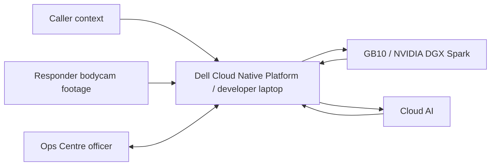

# Project Context

**Last Updated:** 2026-06-23
**Repository:** 1stSight
**Repo Root:** `/home/adoreblvnk/Documents/1stSight`

## 1. Project Identity

- **Purpose:** 1stSight is a Command & Control dashboard for live operations and post-incident review. It turns responder bodycam footage into evidence-linked timelines, reviewable recommendations, selected frames, and concise AAR briefing slides in PDF format so Ops Centre officers can focus on incident sensemaking instead of manually scrubbing every feed.
- **Target Audience:** Primary users are SCDF Ops Centre / C&C officers. Responder footage comes from firefighters, paramedics, or other responders. SCDF/Dell mentors and judges are the external evaluation audience.
- **Challenge & Platform Context:** 1stSight is for the SCDF-Dell Lifesavers' Innovation Challenge 2026, which asks teams to build a working prototype using automation, data, or AI to assist frontline responders, improve operational effectiveness, and/or improve responder safety.
- **Current Scenario Scope:** 1stSight presents two incident scenarios. Both scenarios show an evidence-linked incident timeline. The Punggol residential fire uses the timeline for live C&C recommendations, while the Woodlands medical assistance / responder-safety incident uses the timeline to generate concise AAR briefing slides as a PDF.

### Presenter Narrative

1stSight starts from caller context, then updates the incident record only when responder footage provides evidence. The officer remains responsible for high-impact decisions and final review.

The first scenario is a night-time Punggol residential fire. A caller reports a small fire inside a residential unit at 21 Punggol Field Walk. The caller is outside and reports no visible injuries. SCDF dispatches a Basic Task Force from Punggol Fire Station. 1stSight shows the responding unit on the map, then opens the live dashboard once firefighters arrive. The live view starts with the caller-provided brief only. Bodycam footage becomes the evidence source for fire growth, smoke spread, reduced visibility, entry-control concerns, the live incident timeline, and any resource-escalation recommendation. The presentation should not generate a fire report for this scenario; its product moment is live awareness and officer-reviewed C&C action.

The second scenario is a daytime Woodlands medical assistance incident. 995 receives a request for ambulance assistance at a public walkway near a Woodlands residential estate. The caller reports an adult female appears distressed and may require medical attention. One crew bodycam feed is available. 1stSight reviews the footage after the incident, extracts timestamped evidence cards into an incident timeline, supports responder-safety search, and generates a less wordy evidence-linked AAR briefing slide PDF. Slide-style PDF generation is shown only for this medical/responder-safety scenario in the main presentation flow.

The Woodlands post-incident statement and outcome details are review material, not caller context. Do not put later facts such as prosecution, injuries, charges, or final statements into the initial incident brief. Those details may be used only as post-incident validation or presenter background if they are introduced after the footage review.

## 2. Features

- **Incident Selector:** Lets the officer switch between active or reviewable incidents without mixing evidence across scenarios.
- **Live Deployment Map:** Uses `@vis.gl/react-google-maps` to show a Singapore map with the Basic Task Force moving from Punggol Fire Station to the Punggol residential fire, then enables incident entry once the section reaches the site.
- **Live Responder Feed Area:** Shows available bodycam feed cards with feed video, responder name, and alert indicators. The Punggol fire uses three firefighter bodycam feeds; the Woodlands responder-safety review uses one available crew bodycam feed.
- **Live Events Panel:** Starts empty and fills chronologically with compact events from runtime live chunk analysis, forming the Punggol incident timeline.
- **Live C&C Dashboard:** Shows responder bodycam feeds, live events, and Ops Centre action prompts during the active Punggol residential fire.
- **Live Recommendations:** Creates reviewable Ops Centre recommendations from the observed live event stream, with a one-phrase reason and source-frame screenshot.
- **Incident Review:** Shows a vertical post-incident evidence timeline with frame screenshots, bounding boxes, short labels, search/filter controls, suggested incident tags/titles, and Woodlands AAR briefing slide material after the incident ends.
- **Responder-Safety Search:** Lets officers search analyzed footage for evidence such as aggression, unsafe proximity, obstruction, physical contact, crew intervention, or responder injury. Results must link to matching footage and timestamps.
- **AAR Briefing Slides PDF:** Uses `@react-pdf/renderer` to produce a concise, slide-style, evidence-linked AAR briefing PDF from the Woodlands medical/responder-safety timeline and relevant evidence images. The Punggol fire scenario still shows an incident timeline, but slide/PDF generation is not part of the main fire presentation flow. The PDF is not an official SCDF Fire Report or Ambulance Report.

## 3. Technology Stack & Versions

### Laptop / Dell Cloud Native Platform

- **Runtime & Languages:** Node.js `24`, npm `11`, TypeScript `5`.
- **Frameworks & Libraries:**
  - **App Framework:** Next.js `16`, React `19`.
  - **UI:** Tailwind CSS `4`, shadcn/ui components, Base UI, motion.
  - **AI SDK:** AI SDK `6`, `@ai-sdk/openai`, `@ai-sdk/openai-compatible`, `ai-sdk-provider-codex-cli`.
  - **Maps:** `@vis.gl/react-google-maps`.
  - **Slide PDF Export:** `@react-pdf/renderer`.
  - **Video Processing:** Use system `ffmpeg` from the host/container path; use `execa` and `sharp` for orchestration and frame/image optimization.
  - **Dates:** `date-fns`.
  - **Validation:** Zod `4`.
- **State & Data:** Core data includes incidents, incident objects, responder video/frame evidence, event timelines, recommendations, decision reviews, map markers, AAR slide drafts, and slide-style PDF exports.
- **Development Runtime:** The developer laptop runs the same application locally during implementation and testing.
- **OpenShift Hosting [Cloud Native Platform]:** Dell Cloud Native Platform / Red Hat OpenShift hosts the deployed dashboard/backend, and the containerized app listens on port `8080`.
- **Registry [Cloud Native Platform]:** Harbor stores the container image used for OpenShift deployment.
- **Route & DNS [Cloud Native Platform]:** OpenShift route provides app access; custom DNS is not required for the hackathon presentation.
- **Runtime Secrets [Cloud Native Platform]:** Store `OPENAI_API_KEY`, `GB10_OPENAI_BASE_URL`, `GB10_MODEL_ID`, and `GB10_OPENAI_API_KEY` as OpenShift Secrets for deployed environments.
- **Deployment Credentials [Cloud Native Platform]:** OpenShift login/token or kubeconfig and Harbor username/password or robot token are required for deployment, but they are not app runtime environment variables.
- **Browser Map Key:** `NEXT_PUBLIC_GOOGLE_MAPS_API_KEY` is required for `@vis.gl/react-google-maps`; restrict this browser-exposed key by domain/referrer in Google Cloud.

### GB10 / NVIDIA DGX Spark

- **Role:** Runs the single local GB10 model endpoint for lower-latency local text reasoning where practical.
- **Tech Stack:**
  - **Model Server:** `vLLM`.
  - **API Shape:** OpenAI-compatible `/v1` endpoint.
  - **Local Model:** `nemotron-nano-9b-v2`.
  - **Network Exposure:** Cloudflare Tunnel exposes the GB10 `vLLM` endpoint to the deployed OpenShift app through HTTPS.
  - **App Integration:** AI SDK `@ai-sdk/openai-compatible`.
  - **Endpoint Env:** `GB10_OPENAI_BASE_URL`, using the Cloudflare Tunnel URL for deployed OpenShift and the GB10 LAN URL for local laptop development.
  - **Model Env:** `GB10_MODEL_ID`.
  - **Auth Env:** `GB10_OPENAI_API_KEY` only if endpoint auth is enabled.

### Cloud AI

- **Provider:** OpenAI through AI SDK's OpenAI provider.
- **Model:** `gpt-5.5` is the highest-accuracy Cloud AI model for multimodal vision, tool calling, and reasoning-heavy workflows where intelligence matters more than local-only execution.
- **API Key:** `OPENAI_API_KEY` is required for OpenAI model calls and must not be exposed through `NEXT_PUBLIC_*`.
- **Dev Fallback Provider:** In AI model use cases, `Dev fallback` means `ai-sdk-provider-codex-cli` on the local laptop through the user's ChatGPT subscription when OpenAI provider credentials or the GB10 endpoint are unavailable; it is not the production Cloud AI path for the deployed presentation.
- **Optional NVIDIA NIM:** `NVIDIA_API_KEY` is only required if using hosted NVIDIA NIM APIs instead of the local GB10 endpoint.
- **Compute Boundary:** OpenShift does not provide GPUs for hosted LLMs; GPU-backed local inference runs through GB10, while cloud inference runs through external provider APIs.

### AI Model Use Cases

- **Video-to-structured incident extraction (vision):** Model: `gpt-5.5`; Dev fallback: `gpt-5.5`; converts bodycam frame captures into structured incident objects, timestamps, source references, and short evidence descriptions.
- **Best evidence frame selection (vision):** Model: `gpt-5.5`; Dev fallback: `gpt-5.5`; selects the clearest screenshot/frame that supports each incident object, especially flame growth, smoke, visibility, entry-control observations, unsafe proximity, physical contact, crew intervention, and responder-safety evidence.
- **Bounding box and visual label generation (vision):** Model: `gpt-5.5`; Dev fallback: `gpt-5.5`; creates approximate bounding boxes and one-phrase labels for fire growth, smoke spread, blocked access, unsafe entry, visibility, entry-control observations, and responder-safety evidence.
- **Incident matching, grouping, and titling:** Model: `Nemotron Nano 9B v2`; Dev fallback: `gpt-5.2-codex-mini`; determines whether a new incident object belongs to an existing incident or starts a new one, then groups related objects under titles such as Residential Fire Response or Responder-Safety Review.
- **Live recommendation generation:** Model: `gpt-5.5`; Dev fallback: `gpt-5.5`; creates reviewable Ops Centre recommendations such as Deploy Enhanced Task Force with a reason phrase and evidence frame.
- **Natural-language post-incident search:** Model: `Nemotron Nano 9B v2`; Dev fallback: `gpt-5.2-codex-mini`; maps officer queries such as `Bodycam B escalation`, `Bodycam C smoke`, `unsafe proximity`, or `crew intervention` to relevant incidents, tags, and evidence cards after keyword/tag retrieval.
- **Post-incident timeline summarization:** Model: `Nemotron Nano 9B v2`; Dev fallback: `gpt-5.3-codex`; turns captured incident objects into a chronological evidence timeline for review.
- **AAR slide evidence selection (vision):** Model: `gpt-5.5`; Dev fallback: `gpt-5.5`; selects only the clearest screenshots/evidence cards from the Woodlands responder-safety timeline for inclusion in the AAR briefing slide PDF shown during the presentation.
- **AAR briefing slide generation:** Model: `Nemotron Nano 9B v2`; Dev fallback: `gpt-5.3-codex`; generates concise Woodlands slide content with relevant screenshots, timestamps, sequence of events, challenges, areas done well, and areas for improvement. The Punggol fire scenario uses the same timeline/evidence spine for live awareness and recommendation review, not slide/PDF generation in the main flow.

## 4. Run & Development Commands

- **Prerequisites:** Docker, Git, Node.js `24`, npm `11`, system `ffmpeg`, OpenShift/Keycloak access, and Harbor access.
- **Start Services:** `npm run dev` for local development; containerized deployment runs the app on port `8080` for OpenShift.
- **Useful Commands:** `npm run lint`, `npx tsc --noEmit`, `npm run build`.

## 5. Critical Implementation Rules & Conventions

- **Product Posture:** Build 1stSight as a production-shaped prototype, not a throwaway mockup. Use real product boundaries with real API / AI calls.
- **SCDF-Facing Language:** Avoid casual prototype-stage wording in interface copy, slides, and presenter scripts. Prefer “incident scenario,” “operational scenario,” “available responder footage,” “current footage,” “pilot workflow,” and “prototype workflow.”
- **Code Organization:** Implement the app as a root-level Next.js App Router project using `src/app`, `src/components`, `src/lib`, and browser-served media under `public/videos`.
- **State Management:** Keep stable scenario metadata and source media lists minimal. Post-incident evidence, frame selection, boxes, search answers, and AAR briefing slide content must come from runtime analysis state rather than precomputed scenario evidence.
- **API & Data Fetching:** Keep model calls behind backend/API boundaries so the Ops Centre workflow is not coupled to a specific model provider.
- **AI Output Contract:** All model pipeline steps must use structured output validated with Zod; vision is required only for use cases marked `(vision)`, and tool calling is optional for the prototype pipeline.
- **Development Model Fallback:** `ai-sdk-provider-codex-cli` may replace OpenAI provider or GB10 calls only for local laptop development; keep the same Zod-validated structured schemas and avoid optional schema fields in Codex object generation.
- **Analysis Algorithms:**
  - **Video chunking:** Split live bodycam footage into 5-second chunks.
  - **Frame capture:** Capture frames from each chunk or candidate review interval, preserving source video, responder, timestamp, and frame ID.
  - **Incident extraction:** Use `gpt-5.5` to convert captured frames into structured incident objects.
  - **Incident merging:** Merge repeated incident objects with simple rules.
  - **Evidence scoring:** Score candidate evidence frames for review and AAR slide inclusion.
  - **Review annotation:** Generate review-only bounding boxes and short labels for selected evidence frames.
  - **Recommendation trigger:** Create reviewable recommendations when incident evidence crosses the operational threshold.
  - **Timeline and AAR slide generation:** Generate evidence-linked incident timelines for both Punggol and Woodlands. Use `Nemotron Nano 9B v2` for concise AAR briefing slide content only in the Woodlands medical/responder-safety presentation flow.
- **Types/Interfaces:** Use explicit domain models for incidents, responders, evidence, events, recommendations, decision reviews, map markers, and AAR slide PDF exports.
- **AI Autonomy:** AI may autonomously create incident titles, incident objects, timeline entries, evidence screenshots, tags, and draft recommendations; humans review important or high-impact decisions such as Enhanced Task Force deployment and final AAR slide conclusions.
- **Reliability:** If runtime AI/API analysis fails, show an unavailable/error state instead of substituting fabricated evidence or static analysis. Source footage may seed playback only.
- **Safety Boundaries:** Do not present 1stSight as autonomous tactical command, a medical diagnosis system, facial recognition, an official SCDF Fire Report generator, or an official Ambulance Report generator. The AAR output is a concise briefing slide PDF for officer review.

## 6. Architecture Diagram & Presenter Flow

### Operational Flow

#### Caller Context

1. Caller context starts the incident record.
2. Caller-provided information must stay distinct from responder-footage evidence.
3. Punggol caller context: small fire inside residential unit, 21 Punggol Field Walk, caller outside, no visible injuries reported.
4. Woodlands caller context: ambulance assistance requested at a public walkway near a Woodlands residential estate; adult female appears distressed and may require medical attention.

#### Responder Source

1. Responder bodycam footage is loaded into 1stSight as the current footage source for each incident.
2. Punggol uses three firefighter bodycam feeds for live fire operations.
3. Woodlands uses one available crew bodycam feed for post-incident responder-safety review.
4. Source video is chunked or frame-captured by the backend, with responder, source video, frame, and timestamp references preserved.

#### Ops Centre Officer: Live Punggol Fire

1. Officer opens the deployment map and watches the Basic Task Force travel from Punggol Fire Station to the Punggol residential incident.
2. Officer enters the live incident dashboard when the section reaches the incident site.
3. Officer monitors responder feed cards, live events, and action prompts.
4. Live chunk analysis runs against the current bodycam feeds.
5. 1stSight creates a live incident timeline and a recommendation only when returned model evidence supports it.
6. Officer reviews the recommendation and can approve, reject, or edit the decision record.
7. The presentation stops at live timeline plus officer-reviewed action for Punggol; it does not generate a fire report.

#### Ops Centre Officer: Woodlands Responder-Safety Review

1. Officer switches to the Woodlands medical assistance incident.
2. Officer opens post-incident review for the available bodycam feed.
3. Runtime analysis extracts frames from the current footage and asks the configured model to select review evidence.
4. 1stSight builds a post-incident evidence timeline from the selected frames and source timestamps.
5. Officer searches for responder-safety concerns such as aggression, unsafe proximity, obstruction, physical contact, crew intervention, or responder injury.
6. Officer reviews generated evidence cards with model-returned bounding boxes, one-phrase labels, source references, and review state.
7. Officer exports a concise AAR briefing slide PDF containing selected incident evidence, sequence of events, BWC IDs/timestamps, short image descriptions, main challenges, areas done well, and areas for improvement.

### 10-Minute Presenter Flow

The presentation should be presenter-controlled rather than video-length-controlled. Fire clips can run in parallel as three responder feeds, with escalation reachable through an `Advance feeds` control. The Woodlands review uses one available bodycam feed and should not invent additional feeds.

| Approx. time | Presenter action | Product moment |
| --- | --- | --- |
| 0:00-0:45 | Introduce the bodycam review problem and 1stSight's Ops Centre role. | 1stSight turns responder footage into live awareness and evidence-linked review material. |
| 0:45-1:30 | Open Punggol residential fire and read the caller context. | Map shows Basic Task Force moving from Punggol Fire Station to 21 Punggol Field Walk. |
| 1:30-2:15 | Enter the live fire dashboard. | Three firefighter bodycam feeds, empty/early incident timeline, and empty recommendation panel. |
| 2:15-3:30 | Run live frame analysis. | Current frames are extracted and turned into timestamped incident timeline events with source feed references. |
| 3:30-4:30 | Advance to the fire growth moment. | 1stSight creates a C&C-level recommendation with evidence frame and reason. |
| 4:30-5:00 | Review the recommendation. | Officer approves, rejects, or edits; the decision is recorded as officer-reviewed. |
| 5:00-5:30 | Transition to post-incident review. | Same evidence pipeline, different incident type and footage availability. |
| 5:30-6:15 | Open Woodlands medical assistance. | One available bodycam feed is used for responder-safety review. |
| 6:15-7:15 | Analyze Woodlands footage. | 1stSight generates a timestamped incident timeline with BWC/source, frame, description, and review state. |
| 7:15-8:00 | Search responder-safety moments. | Queries such as unsafe proximity, physical contact, crew intervention, responder injury, or aggression filter to matching evidence. |
| 8:00-9:00 | Generate the AAR briefing slides. | PDF output uses slide-style pages with incident context, sequence of events, BWC timestamps, selected frames, short descriptions, challenges, areas done well, and areas for improvement. |
| 9:00-9:40 | Tie to SCDF reporting feedback. | 1stSight creates the BWC evidence spine that can be combined with appliance summaries, casualty details, routes, layouts, control points, CCTV, and crew statements. |
| 9:40-10:00 | Close. | Both scenarios show incident timelines; fire shows live C&C recommendations, and Woodlands shows faster evidence-linked AAR briefing slide preparation. |

## 7. State Models

- **Incident:** Top-level scenario group such as Punggol Residential Fire or Woodlands Medical Assistance, containing related incident objects and review/export state.
- **IncidentObject:** Atomic incident evidence item such as flame burst frame, smoke spread frame, blocked exit frame, entry-control frame, unsafe-proximity frame, physical-contact frame, recommendation, or officer approval.
- **Responder:** Firefighter/responder identity, role, feed/source reference, and current position/status where available.
- **FrameEvidence / VideoEvidence:** Captured source video segment or best-supporting frame with timestamp, responder/source, labels, bounding boxes, and links to incident objects.
- **IncidentEvent:** Timeline item derived from AI processing, human review, or system status updates.
- **SuggestedAction:** Ops-centre recommendation such as ambulance support, evacuation support, command review, or Enhanced Task Force escalation.
- **DecisionReview:** Human review record for important AI outputs, high-impact recommendations, official facts, and AAR briefing slide conclusions.
- **EvidenceCard:** Post-incident screenshot/frame card with short description, incident tag, bounding box, one-phrase label, and review state.
- **AARSlideDeck:** Concise slide-style PDF generated from the selected Woodlands medical/responder-safety incident timeline and relevant evidence images during the presentation. Punggol fire uses timeline evidence for live recommendation review rather than PDF generation.

## 8. External Integrations & APIs

- **Dell Cloud Native Platform / OpenShift:** Deployment foundation for the dashboard/backend.
- **Harbor:** Image registry for OpenShift deployment.
- **Keycloak:** Platform authentication for OpenShift and Harbor access.
- **Dell GB10:** Local compute layer for text reasoning through a single `Nemotron Nano 9B v2` endpoint; note Dell GB10 as NVIDIA DGX Spark, with Dell materials also naming Dell AI PC / Dell Pro Max with GB10.
- **Cloudflare Tunnel:** Secure HTTPS tunnel from the deployed OpenShift app to the GB10-hosted OpenAI-compatible `vLLM` endpoint.
- **NVIDIA NIM:** Model-serving path through hosted API calls or self-hosted containers, subject to GB10/GPU limits.
- **Cloud AI Providers:** Use AI SDK's OpenAI provider for `gpt-5.5` via OpenAI key and AI SDK's OpenAI-compatible provider for the local hosted GB10 model exposed through an OpenAI-compatible endpoint.
- **Fire Video Sources:** Current Punggol fire footage uses three fire-response clips served from `public/videos/fire/` as `/videos/fire/fire-feed-a.mp4`, `/videos/fire/fire-feed-b-escalation.mp4`, and `/videos/fire/fire-feed-c.mp4`.
- **Responder-Safety Video Source:** Current Woodlands footage is available at `downloads/abuse.mp4` and should be moved into a browser-served path such as `public/videos/woodlands/woodlands-medical-bodycam.mp4` before wiring it into the app.
- **Formal Incident Data:** Future upload/integration may accept fire report, medical report, casualty/conveyance details, appliance summaries, crew statements, routes, layouts, control points, CCTV references, and building/floor plans as source data around the BWC timeline. These fields support review context; they are not generated as official reports by 1stSight.

## 9. AAR Briefing Slide Requirements From SCDF Feedback

1stSight should prioritize the BWC evidence layer first, then turn selected evidence into a less wordy AAR briefing slide PDF. Formal incident data can be added around the timeline when available, but the product should not claim to generate official fire or ambulance reports.

- **Fast AAR briefing output:** AAR slides should come out faster than longer-form fire or medical reports.
- **BWC evidence:** Include BWC/source ID, timestamp, selected frame, and plain description of what the image shows.
- **Sequence of events:** Build a timestamped event sequence adapted from available incident records and footage evidence, presented as slide-friendly milestones rather than dense prose.
- **Responder-safety review:** Include main challenges, areas done well, and areas for improvement as concise slide bullets.
- **Optional formal data fields:** Support upload/integration for dispatched appliances, casualty status, ambulance call sign, conveyance/hospital destination, patient identifiers where authorized, injury description, home address, route taken by first appliance, control points, CCTV footage references, floor layouts, affected-unit/source-of-fire layouts, suppression design images, past photos, damage photos, and crew statements.
- **Boundary:** Do not fabricate formal data fields from footage. If a field is not present in uploaded incident data or visible evidence, mark it as unavailable or pending officer input. Do not label the slide PDF as an official SCDF Fire Report or Ambulance Report.

## 10. Assumptions, Risks & Missing Information

- **Assumption:** `PROJECT_CONTEXT.md` is the single source of truth for current product, scenario, architecture, and implementation direction.
- **Implementation Gap:** Existing source code may still contain older Punggol venue wording and may not yet include the Woodlands incident in `src/lib/scenario.ts` or `public/videos/woodlands/`.
- **Risk:** Fire-response and responder-safety footage require careful sourcing, editing, and usage checks.
- **Risk:** GB10 availability, model compatibility, and Cloudflare Tunnel reachability must be validated before relying on local text reasoning in the deployed presentation.
- **Risk:** Cloud AI use for sensitive incident footage requires explicit data-governance approval before any real SCDF-like data is sent to third-party providers.
- **Missing:** Final Woodlands location label, responder role/call sign, BWC ID naming convention, and whether to include audio/transcript analysis in the first presenter-ready build.

## 11. Finale Demo Surfaces & Logistics

See `resources/SCDF Finale Logistics and Demo Modes.md` for the full organiser timeline, rehearsal slot, finale agenda, stage/booth setup notes, and judge list.

- **Stage Demo Scope:** The main stage presentation should focus on two flows: Punggol house fire and Woodlands medical / responder-safety review.
- **Punggol Stage Flow:** Show the live C&C dashboard, three firefighter bodycam feeds, live incident timeline, and officer-reviewed recommendation flow. Incident review can be shown as an evidence timeline / review surface, but do not generate a fire report or AAR slide PDF for Punggol.
- **Woodlands Stage Flow:** Show the medical assistance / responder-safety flow with one available bodycam feed, incident review timeline, responder-safety search, and AAR briefing slide PDF generation. Woodlands may start from a dashboard-style view, but the main product moment is review plus AAR slides.
- **Ubi Booth Flow:** Ubi live site bodycam/dashboard is a booth-only demo surface, not part of the main on-stage presentation. Use it to demonstrate the system with booth hardware and the GB10 nearby.
- **GB10 Constraint:** The GB10 remains at the booth and is not intended to be brought on stage. Stage demos should not rely on carrying the GB10 to the stage; use a tested deployed/tunnel endpoint only if reliable, otherwise keep the stage demo on laptop/cloud-backed paths.
- **Finale Format:** Each team has 20 minutes on stage: 15 minutes presentation plus 5 minutes Q&A. Booth setup starts from 10am on 3 July 2026 at SCDF HQ Ubi.
