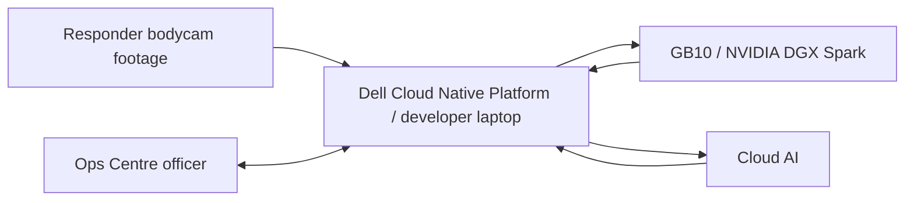

# Project Context

**Last Updated:** 2026-06-18
**Repository:** 1stSight
**Repo Root:** `/home/adoreblvnk/Documents/1stSight`

## 1. Project Identity

- **Purpose:** 1stSight is a Command & Control dashboard for live operations and post-incident review, built around responder bodycam footage. It turns responder footage into event timelines, suggested actions, draft reports, and an optional 2D minimap so Ops Centre officers can focus on the broader incident picture instead of watching individual feeds.
- **Target Audience:** Primary users are Ops Centre / C&C officers; responder footage comes from firefighters or responders, and the hackathon demonstration is evaluated by SCDF/Dell mentors and judges.
- **Challenge & Platform Context:** 1stSight is for the SCDF-Dell Lifesavers' Innovation Challenge 2026, which asks teams to build a working prototype using automation, data, or AI to assist frontline responders, improve operational effectiveness, and/or improve responder safety.
- **Demo Scope:** The demo is a small-stage skit covering a Punggol warehouse fire escalation and a responder-safety/physical-abuse evidence case, using stitched warehouse-fire footage and self-filmed assault footage presented as live bodycam feeds.

### Demo Narrative

A small fire is reported at a Punggol warehouse, and SCDF deploys a Basic Task Force from Punggol Fire Station. 1stSight shows the section moving on a Singapore map toward the warehouse, then enters the live incident dashboard when the section reaches the site. The first view is manageable: a small blaze, responder bodycam feeds, live events, and the start of an incident timeline.

Inside the warehouse, the fire escalates sharply in a storage room, but Firefighter A does not report the worsening condition because he believes the six-person team can handle it. 1stSight analyzes the bodycam feed, selects the best supporting screenshot, creates a Fire Escalation incident object, and recommends Deploy Enhanced Task Force with reason `flame spread increased inside storage room` and evidence `Firefighter A bodycam, 14:03:21`. This is the key Ops Centre moment: 1stSight catches the escalation even when the front line does not escalate it verbally.

After the fire dies down, the warehouse owner arrives, tries to force entry into the structurally unsafe site, pushes an SCDF responder, and attempts a punch. 1stSight records the physical abuse incident into the post-incident timeline with evidence frames, bounding boxes, one-phrase labels, and the suggested tag `abuse`. Back at Ops Centre, the officer searches or selects the abuse incident, reviews default-selected screenshots, rejects false flags if needed, and generates a structured observation report containing only the selected incident evidence and analysis.

## 2. Features

- **Live Deployment Map:** Uses `@vis.gl/react-google-maps` to show a Singapore map with the Basic Task Force moving from Punggol Fire Station to the Punggol warehouse, then enables incident entry once the section reaches the site.
- **Live Responder Feed Area:** Shows near-live responder feed cards with feed video, responder name, status cues, and alert indicators without drawing bounding boxes over the live feed.
- **Live Events Panel:** Shows timestamped incident events with alert/event type, review state, linked source frame, evidence reference, and quick approve/reject/edit actions for reviewed items.
- **Live C&C Dashboard:** Shows responder bodycam feeds, live events, ops-centre action prompts, and an approximate scene view during the active warehouse incident.
- **Live Recommendations:** Creates reviewable recommendations such as Deploy Enhanced Task Force, with reason and evidence fields rather than confidence scores.
- **Incident Review:** Shows post-incident evidence timeline, evidence cards with bounding boxes and short labels, search/filter controls, suggested incident tags/titles, and draft report material after the incident ends.
- **Draft Reports:** Uses `@react-pdf/renderer` to produce PDF structured observation reports from selected incident timelines and relevant evidence images.
- **2D Minimap / Scene Context [Optional]:** Shows approximate site layout, responder positions, places of interest, fire/smoke zones, blocked access, and ambulance handover points.

## 3. Technology Stack & Versions

### Laptop / Dell Cloud Native Platform

- **Runtime & Languages:** Node.js `24`, npm, TypeScript `6`.
- **Frameworks & Libraries:**
  - **App Framework:** Next.js `16`, React `19`.
  - **UI:** Tailwind CSS `4`, shadcn/ui, motion.
  - **AI SDK:** AI SDK `6`, `@ai-sdk/openai`, `@ai-sdk/openai-compatible`, `ai-sdk-provider-codex-cli`.
  - **Maps:** `@vis.gl/react-google-maps`.
  - **PDF Export:** `@react-pdf/renderer`.
  - **Validation:** Zod.
- **State & Data:** Core data includes incidents, incident objects, responder video/frame evidence, event timelines, recommendations, minimap markers, decision reviews, and draft reports.
- **Development Runtime:** The developer laptop runs the same application locally during implementation and testing.
- **OpenShift Hosting [Cloud Native Platform]:** Dell Cloud Native Platform / Red Hat OpenShift hosts the deployed dashboard/backend, and the containerized app listens on port `8080`.
- **Registry [Cloud Native Platform]:** Harbor stores the container image used for OpenShift deployment.
- **Route & DNS [Cloud Native Platform]:** OpenShift route provides app access; custom DNS is not required for the hackathon demo.
- **Runtime Secrets [Cloud Native Platform]:** Store `OPENAI_API_KEY`, `GB10_OPENAI_BASE_URL`, `GB10_MODEL_ID`, and `GB10_OPENAI_API_KEY` as OpenShift Secrets for deployed environments.
- **Deployment Credentials [Cloud Native Platform]:** OpenShift login/token or kubeconfig and Harbor username/password or robot token are required for deployment, but they are not app runtime environment variables.
- **Browser Map Key:** `NEXT_PUBLIC_GOOGLE_MAPS_API_KEY` is required for `@vis.gl/react-google-maps`; restrict this browser-exposed key by domain/referrer in Google Cloud.

### GB10 / NVIDIA DGX Spark

- **Role:** Runs the single local GB10 model endpoint for lower-latency local text reasoning where practical.
- **Tech Stack:**
  - **Model Server:** `vLLM`.
  - **API Shape:** OpenAI-compatible `/v1` endpoint.
  - **Local Model:** `nemotron-nano-9b-v2`.
  - **Network Exposure:** Cloudflare Tunnel exposes the GB10 `vLLM` endpoint to the deployed OpenShift app through HTTPS.
  - **App Integration:** AI SDK `@ai-sdk/openai-compatible`.
  - **Endpoint Env:** `GB10_OPENAI_BASE_URL`, using the Cloudflare Tunnel URL for deployed OpenShift and the GB10 LAN URL for local laptop development.
  - **Model Env:** `GB10_MODEL_ID`.
  - **Auth Env:** `GB10_OPENAI_API_KEY` only if endpoint auth is enabled.

### Cloud AI

- **Provider:** OpenAI through AI SDK's OpenAI provider.
- **Model:** `gpt-5.5` is the highest-accuracy Cloud AI model for multimodal vision, tool calling, and reasoning-heavy workflows where intelligence matters more than local-only execution.
- **API Key:** `OPENAI_API_KEY` is required for OpenAI model calls and must not be exposed through `NEXT_PUBLIC_*`.
- **Dev Fallback Provider:** In AI model use cases, `Dev fallback` means `ai-sdk-provider-codex-cli` on the local laptop through the user's ChatGPT subscription when OpenAI provider credentials or the GB10 endpoint are unavailable; it is not the production Cloud AI path for the deployed demo.
- **Optional NVIDIA NIM:** `NVIDIA_API_KEY` is only required if using hosted NVIDIA NIM APIs instead of the local GB10 endpoint.
- **Compute Boundary:** OpenShift does not provide GPUs for hosted LLMs; GPU-backed local inference runs through GB10, while cloud inference runs through external provider APIs.

### AI Model Use Cases

- **Video-to-structured incident extraction (vision):** Model: `gpt-5.5`; Dev fallback: `gpt-5.5`; converts one-second bodycam samples into structured incident objects, timestamps, source references, short evidence descriptions, and confidence notes.
- **Best evidence frame selection (vision):** Model: `gpt-5.5`; Dev fallback: `gpt-5.5`; selects the clearest screenshot/frame that supports each incident object, especially flame burst and physical abuse evidence.
- **Bounding box and visual label generation (vision):** Model: `gpt-5.5`; Dev fallback: `gpt-5.5`; creates approximate bounding boxes and one-phrase labels for fire growth, smoke spread, blocked exits, unsafe entry, pushing, and attempted punch evidence.
- **Incident matching, grouping, and titling:** Model: `Nemotron Nano 9B v2`; Dev fallback: `gpt-5.2-codex-mini`; determines whether a new incident object belongs to an existing incident or starts a new one, then groups related objects under titles such as Fire Escalation or Physical Abuse.
- **Live recommendation generation:** Model: `gpt-5.5`; Dev fallback: `gpt-5.5`; creates reviewable Ops Centre recommendations such as Deploy Enhanced Task Force with reason and evidence fields.
- **Natural-language post-incident search:** Model: `Nemotron Nano 9B v2`; Dev fallback: `gpt-5.2-codex-mini`; maps officer queries such as `warehouse owner is abusive?` to relevant incidents, tags, and evidence cards after keyword/tag retrieval.
- **Post-incident timeline summarization:** Model: `Nemotron Nano 9B v2`; Dev fallback: `gpt-5.3-codex`; turns captured incident objects into a chronological evidence timeline for review.
- **Report evidence selection (vision):** Model: `gpt-5.5`; Dev fallback: `gpt-5.5`; selects only the relevant screenshots/evidence cards from selected incidents for inclusion in the report.
- **Structured observation report generation:** Model: `Nemotron Nano 9B v2`; Dev fallback: `gpt-5.3-codex`; generates selected-incident observation reports with relevant screenshots and concise analysis.

## 4. Run & Development Commands

- **Prerequisites:** Docker, Git, Node.js `24`, npm, OpenShift/Keycloak access, and Harbor access.
- **Start Services:** `npm run dev` for local development; containerized deployment runs the app on port `8080` for OpenShift.
- **Useful Commands:** `npm run lint`, `npm run typecheck`, `npm run build`.

## 5. Critical Implementation Rules & Conventions

- **Code Organization:** Implement the app as a Next.js App Router project under `/app`, with reusable UI components, domain models, demo data, and AI adapters kept separate.
- **State Management:** Keep the hackathon prototype minimal; use deterministic scenario state and lightweight persistence before adding a production database.
- **API & Data Fetching:** Keep model calls behind backend/API boundaries so the Ops Centre workflow is not coupled to a specific model provider.
- **AI Output Contract:** All model pipeline steps must use structured output validated with Zod; vision is required only for use cases marked `(vision)`, and tool calling is optional for the demo pipeline.
- **Development Model Fallback:** `ai-sdk-provider-codex-cli` may replace OpenAI provider or GB10 calls only for local laptop development; keep the same Zod-validated structured schemas and avoid optional schema fields in Codex object generation.
- **Demo Algorithms:**
  - **Video chunking:** Split bodycam footage into 5-second chunks.
  - **Frame sampling:** Sample 1 frame per second from each chunk.
  - **Incident extraction:** Use `gpt-5.5` to convert sampled frames into structured incident objects.
  - **Incident merging:** Merge repeated incident objects with simple rules.
  - **Evidence scoring:** Score candidate evidence frames for review and reporting.
  - **Review annotation:** Generate review-only bounding boxes and short labels for selected evidence frames.
  - **Recommendation trigger:** Create reviewable recommendations when incident evidence crosses the demo threshold.
  - **Timeline and report generation:** Use `Nemotron Nano 9B v2` to generate post-incident timelines and structured observation reports.
- **Types/Interfaces:** Use explicit domain models for incidents, responders, evidence, events, recommendations, decision reviews, map markers, and reports.
- **AI Autonomy:** AI may autonomously create incident titles, incident objects, timeline entries, evidence screenshots, tags, optional minimap updates, and draft recommendations; humans review important or high-impact decisions such as Enhanced Task Force deployment and final report conclusions.
- **Demo Reliability:** Use deterministic fallback behavior for AI/API failures; product UI should present demo assets as live 1stSight feeds.
- **Safety Boundaries:** Do not present 1stSight as autonomous tactical command, a medical diagnosis system, facial recognition, or an official SCDF Fire Report / Ambulance Report generator unless explicitly approved.

## 6. Architecture Diagram & Demo Flow

### Demo Flow

#### End User: Responder Source

1. Responder bodycam viewpoint is represented by staged or sourced fire/assault footage loaded into 1stSight.
2. 1stSight presents the footage as live responder feeds during the demo.
3. Source video is chunked into 5-second segments and sampled at 1 frame per second.
4. Each sampled frame keeps responder, source video, chunk, frame, and timestamp references.

#### Ops Centre Officer: Live Incident

1. Officer opens the deployment map and watches the Basic Task Force travel from Punggol Fire Station to the Punggol warehouse.
2. Officer enters the live incident dashboard when the section reaches the incident site.
3. Officer monitors responder feed cards, live events, and action prompts.
4. 1stSight detects fire escalation from Firefighter A's bodycam and creates Fire Escalation timeline evidence.
5. 1stSight recommends Deploy Enhanced Task Force with reason `flame spread increased inside storage room` and evidence `Firefighter A bodycam, 14:03:21`.
6. Officer reviews the recommendation and can approve, reject, or edit the decision record.

#### Ops Centre Officer: Post-Incident

1. Officer switches to incident review after the live scenario ends.
2. Officer searches naturally or selects a suggested tag such as `abuse`.
3. 1stSight shows the physical abuse incident timeline with default-selected evidence frames.
4. Officer reviews evidence cards with bounding boxes, one-phrase labels, source references, and review state.
5. Officer rejects false flags or adjusts selected evidence if needed.
6. Officer exports a structured observation report containing only the selected incident evidence and analysis.

## 7. State Models

- **Incident:** Top-level scenario group such as Fire Escalation or Physical Abuse, containing related incident objects and report state.
- **IncidentObject:** Atomic incident evidence item such as flame burst frame, smoke spread frame, blocked exit frame, physical assault frame, recommendation, or officer approval.
- **Responder:** Firefighter/responder identity, role, feed/source reference, and current position/status where available.
- **FrameEvidence / VideoEvidence:** One-second sampled source video segment or best-supporting frame with timestamp, responder/source, labels, bounding boxes, and links to incident objects.
- **IncidentEvent:** Timeline item derived from AI processing, human review, or system status updates.
- **SuggestedAction:** Ops-centre recommendation such as ambulance support, evacuation support, command review, or Enhanced Task Force escalation.
- **DecisionReview:** Human review record for important AI outputs, high-impact recommendations, official facts, and report conclusions.
- **MinimapMarker [Optional]:** Approximate scene marker for responder position, hazard zone, blocked access, exit, casualty location, or handover point.
- **EvidenceCard:** Post-incident screenshot/frame card with short description, incident tag, bounding box, one-phrase label, and review state.
- **DraftReport:** Structured observation report generated from selected incidents and relevant evidence images; if no incident is selected, include all incidents.

## 8. External Integrations & APIs

- **Dell Cloud Native Platform / OpenShift:** Deployment foundation for the dashboard/backend.
- **Harbor:** Image registry for OpenShift deployment.
- **Keycloak:** Platform authentication for OpenShift and Harbor access.
- **Dell GB10:** Local compute layer for text reasoning through a single `Nemotron Nano 9B v2` endpoint; note Dell GB10 as NVIDIA DGX Spark, with Dell materials also naming Dell AI PC / Dell Pro Max with GB10.
- **Cloudflare Tunnel:** Secure HTTPS tunnel from the deployed OpenShift app to the GB10-hosted OpenAI-compatible `vLLM` endpoint.
- **NVIDIA NIM:** Model-serving path through hosted API calls or self-hosted containers, subject to GB10/GPU limits.
- **Cloud AI Providers:** Use AI SDK's OpenAI provider for `gpt-5.5` via OpenAI key and AI SDK's OpenAI-compatible provider for the local hosted GB10 model exposed through an OpenAI-compatible endpoint.
- **Video Sources:** Demo footage combines warehouse-fire footage from YouTube or similar sources with self-filmed warehouse-owner assault footage.

## 9. Assumptions, Risks & Missing Information

- **Assumption:** `PROJECT_CONTEXT.md` is the single source of truth for current product, demo, architecture, and implementation direction.
- **Risk:** YouTube warehouse-fire footage may require careful sourcing, editing, and usage checks; self-filmed assault footage avoids rights ambiguity for the abuse segment.
- **Risk:** GB10 availability, model compatibility, and Cloudflare Tunnel reachability must be validated before relying on local text reasoning in the deployed demo.
- **Risk:** Cloud AI use for sensitive incident footage requires explicit data-governance approval before any real SCDF-like data is sent to third-party providers.
