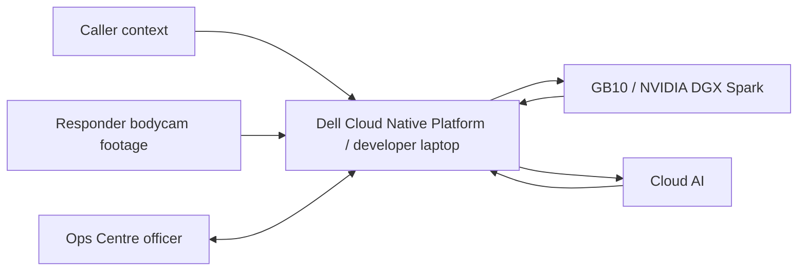

# Project Context

**Last Updated:** 2026-07-02
**Repository:** 1stSight
**Repo Root:** `/home/adoreblvnk/Documents/1stSight`

## 1. Project Identity

- **Purpose:** 1stSight is a Command & Control dashboard for live operations and post-incident review. It turns responder bodycam footage into evidence-linked timelines, reviewable recommendations, selected frames, and concise AAR briefing slides in editable PPTX and PDF formats so Ops Centre officers can focus on incident sensemaking instead of manually scrubbing every feed.
- **Target Audience:** Primary users are SCDF Ops Centre / C&C officers. Responder footage comes from firefighters, paramedics, or other responders. SCDF/Dell mentors and judges are the external evaluation audience.
- **Challenge & Platform Context:** 1stSight is for the SCDF-Dell Lifesavers' Innovation Challenge 2026, which asks teams to build a working prototype using automation, data, or AI to assist frontline responders, improve operational effectiveness, and/or improve responder safety.
- **Current Scenario Scope:** 1stSight presents one primary stage scenario and secondary booth scenarios. The stage scenario is a continuous Punggol landed-house fire incident next to a building that starts with live fire response, then continues into a post-fire sweep / welfare check and responder-safety event beside the adjacent building. Woodlands medical assistance remains available as a booth or secondary exploration flow, but it is not the main on-stage AAR story.

### Presenter Narrative

1stSight follows one Punggol incident end to end: first call, live bodycam understanding, fire escalation, post-fire responder-safety risk, then AAR briefing slides. Caller context starts the incident record, but bodycam footage is the evidence source for later claims. The officer remains responsible for high-impact decisions and final review. In SCDF practice, AAR slides are typically prepared within 24 hours after an incident; they become the immediate briefing outcome and can support a later incident report if one is needed.

Final demo story:

- **First call:** Caller reports a small landed-house fire at 21 Punggol Field Walk. Caller is outside; no visible injuries are reported at this stage.
- **Live bodycam feeds:** Ops Centre sees three responder POVs: Tze Kai on Bodycam A, Joseph on Bodycam B, and Jia Jia on Bodycam C.
- **Live incident events:** As the feeds run, 1stSight analyses the current video windows and turns supported observations into one live incident timeline.
- **Fire escalation:** Bodycam evidence shows the fire growing beyond the initial caller report.
- **Recommendation 1:** Once the supporting evidence window is processed, 1stSight raises Enhanced Task Force consideration. The officer marks it for Ground Commander consideration; the system records an officer-reviewed decision and does not autonomously deploy resources.
- **Post-fire shift:** After containment, the risk changes from fire growth to responder safety during the welfare check. Tze Kai and Joseph continue on Bodycam A and Bodycam B; Bodycam C is intentionally not attached to this phase.
- **Responder-safety incident:** The sweep captures unsafe proximity, physical contact, and Joseph's impact / recovery across two bodycams. Verbal aggression remains a search example when audio/transcript review is deliberately shown.
- **Recommendation 2:** After processing the post-fire POV evidence, 1stSight raises police-support / responder-safety guidance for officer review, again kept as Ground Commander consideration.
- **Review:** Post-incident review links dispatch, fire escalation, ETF review, welfare check, responder-safety evidence, officer decisions, and major incident milestones into one evidence timeline.
- **Export 1:** With no search active, generate the full incident AAR briefing deck from the strongest selected evidence across the Punggol timeline. The deck should show what was done well and what can be discussed or improved, using milestone screenshots where available.
- **Search:** Use natural-language search to highlight matching evidence cards while keeping source frames and timestamps attached. For the stage, type `drunk abuse` to show rough officer-language retrieval, then frame the returned evidence as physical contact, unsafe proximity, impact / recovery, and responder-safety evidence rather than a legal or medical conclusion. For medical-abuse review, the product should focus on retrieving the recording and transcript around the relevant verbal or physical abuse moment, not inferring intent.
- **Export 2:** With responder-safety search active, generate a focused responder-safety AAR briefing deck from highlighted evidence, including selected responder-safety frames and officer-reviewed action items. Keep the main stage emphasis on the fire case and full-incident AAR outcome.

One-line stage version: “We follow one Punggol fire incident from first call to live bodycam understanding, fire escalation, and post-fire responder-safety risk, with 1stSight raising officer-reviewed recommendations live and turning the same evidence into either a full incident AAR deck or a focused responder-safety AAR briefing deck.”

Woodlands remains available for booth visitors and secondary demos only. The main stage story stays with Punggol from dispatch through post-fire responder-safety review and AAR briefing slide generation.

## 2. Features

- **Incident Selector:** Lets the officer switch between active or reviewable incidents without mixing evidence across scenarios.
- **Live Deployment Map:** Uses `@vis.gl/react-google-maps` to show a Singapore map with the Basic Task Force moving from Punggol Fire Station to the Punggol landed house fire, then enables incident entry once the section reaches the site.
- **Live Responder Feed Area:** Shows available bodycam feed cards with feed video, responder name, and alert indicators. The Punggol fire response uses three firefighter bodycam feeds: Tze Kai as Bodycam A, Joseph as Bodycam B, and Jia Jia as Bodycam C. The post-fire welfare phase continues with A and B POV footage only; Bodycam C should be intentionally marked absent / not attached for that phase, not shown as broken.
- **Live Events Panel:** Starts empty and fills chronologically with compact events from runtime live chunk analysis, forming the Punggol incident timeline.
- **Live Timestamp Model:** The live demo session clock starts when the presenter opens the live dashboard. Caller/call-received context is treated as 20 minutes before that live start. UI-facing timestamps display in `hh:mm:ss`; user-facing copy must not expose raw source offsets. Fire footage timestamps display as live start time + fire video offset. Post-fire welfare-check / responder-safety timestamps display as live start time + full fire-video duration + post-fire video offset. Live events and recommendations must use the analyzed frame/source offset to compute the UI clock time.
- **Live C&C Dashboard:** Shows responder bodycam feeds, live events, and Ops Centre action prompts during the active Punggol landed house fire. Live analysis cards should not show tag chips such as `entry control`; keep them as short event titles, source names, and evidence text. Clicking any live event or recommendation evidence thumbnail should open a larger image preview.
- **Live Recommendations:** Creates reviewable Ops Centre recommendations from the observed live event stream, with a one-phrase reason and source-frame screenshot. Punggol live recommendations are capped to three stage-critical prompts: first ETF consideration only when Bodycam B flame growth is large enough around `01:16`, later sustained ETF consideration, and post-fire on-site police support for responder safety. Once supporting evidence is processed, the related live event should be visible before the officer-review recommendation appears. Presenter and audience-facing copy must frame recommendation readiness as evidence processing and must not expose implementation timing mechanics. Earlier orange lighting / emergency-light cues must remain live events only and must not be labelled as flame evidence. UI copy must show computed incident clock time rather than raw source offsets.
- **Incident Review:** Shows a vertical post-incident evidence timeline with frame screenshots, bounding boxes, short labels, search/filter controls, suggested incident tags/titles, and AAR briefing slide material after the incident ends. The stage review should use the full Punggol incident timeline, including the landed house fire response, post-fire sweep beside the building, welfare check, physical-contact evidence, and officer decisions.
- **Responder-Safety Search:** Lets officers search analyzed footage for evidence such as physical contact, responder safety, unsafe proximity, crew intervention, recovery, spacing, or verbal aggression when audio/transcript review is enabled. Results must link to matching footage and timestamps.
- **AAR Briefing Slides Export:** Uses `pptxgenjs` to produce an editable AAR briefing PPTX and `@react-pdf/renderer` to produce a concise, slide-style, evidence-linked AAR briefing PDF from the selected incident timeline and relevant evidence images. AAR slides are typically prepared within 24 hours after an incident and may support a later incident report if needed. For stage, the default AAR export covers the strongest selected evidence across the full Punggol incident: fire response, fire escalation, post-fire welfare check, responder-safety evidence, officer decisions, and major incident milestones. If the officer searches for `physical contact`, `responder safety`, `verbal aggression`, or similar responder-safety evidence, matching evidence cards are highlighted and the AAR export stays focused on those search results until the search is cleared. The PPTX/PDF output is AAR briefing material and incident-report support, not the formal incident report itself.

## 3. Technology Stack & Versions

### Laptop / Dell Cloud Native Platform

- **Runtime & Languages:** Node.js `24`, npm `11`, TypeScript `5`.
- **Frameworks & Libraries:**
  - **App Framework:** Next.js `16`, React `19`.
  - **UI:** Tailwind CSS `4`, shadcn/ui components, Base UI, motion.
  - **AI SDK:** AI SDK `6`, `@ai-sdk/openai`, `@ai-sdk/openai-compatible`, `ai-sdk-provider-codex-cli`.
  - **Maps:** `@vis.gl/react-google-maps`.
  - **Slide Export:** `pptxgenjs` for editable PPTX and `@react-pdf/renderer` for PDF.
  - **Video Processing:** Use system `ffmpeg` from the host/container path; use `execa` and `sharp` for orchestration and frame/image optimization.
  - **Dates:** `date-fns`.
  - **Validation:** Zod `4`.
- **State & Data:** Core data includes incidents, incident objects, responder video/frame evidence, event timelines, recommendations, decision reviews, map markers, AAR slide drafts, editable PPTX exports, and slide-style PDF exports.
- **Development Runtime:** The developer laptop runs the same application locally during implementation and testing.
- **OpenShift Hosting [Cloud Native Platform]:** Dell Cloud Native Platform / Red Hat OpenShift hosts the deployed dashboard/backend, and the containerized app listens on port `8080`.
- **OpenShift Console [Cloud Native Platform]:** `https://console-openshift-console.apps.innovate.sg-aie.com/`.
- **Registry [Cloud Native Platform]:** Harbor stores the container image used for OpenShift deployment.
- **Harbor Console [Cloud Native Platform]:** `https://ihl-harbor.apps.innovate.sg-aie.com/`.
- **Route & DNS [Cloud Native Platform]:** OpenShift route provides app access; custom DNS is not required for the hackathon presentation.
- **Runtime Secrets [Cloud Native Platform]:** Store `AI_MODEL_MODE`, `OPENAI_API_KEY`, `GB10_OPENAI_BASE_URL`, and `GB10_OPENAI_API_KEY` as OpenShift Secrets for deployed environments.
- **Deployment Credentials [Cloud Native Platform]:** OpenShift login/token or kubeconfig and Harbor username/password or robot token are required for deployment, but they are not app runtime environment variables.
- **Browser Map Key:** `NEXT_PUBLIC_GOOGLE_MAPS_API_KEY` is required for `@vis.gl/react-google-maps`; restrict this browser-exposed key by domain/referrer in Google Cloud. Do not introduce a separate Google Maps browser map ID environment variable or public config field.

### GB10 / NVIDIA DGX Spark

- **Role:** Runs the single local GB10 model endpoint for lower-latency local text reasoning where practical.
- **Tech Stack:**
  - **Model Server:** `vLLM`.
  - **API Shape:** OpenAI-compatible `/v1` endpoint.
  - **Local Model:** `nemotron-nano-9b-v2`.
  - **Network Exposure:** Cloudflare Tunnel exposes the GB10 `vLLM` endpoint to the deployed OpenShift app through HTTPS.
  - **Current Same-Wi-Fi GB10 Target:** `user1@192.168.0.102` for laptop/WSL-to-GB10 setup and local testing. SSH is password-based for current setup; do not commit the password to project files.
  - **Current Same-Wi-Fi GB10 vLLM Runtime:** `nvcr.io/nvidia/vllm:26.05.post1-py3` serves `nvidia/NVIDIA-Nemotron-Nano-9B-v2` as `gb10-local-text` at `http://192.168.0.102:8000/v1` for laptop/WSL development.
  - **App Integration:** AI SDK `@ai-sdk/openai-compatible`.
  - **Endpoint Env:** `GB10_OPENAI_BASE_URL`, using the Cloudflare Tunnel URL for deployed OpenShift and the GB10 LAN URL for local laptop development.
  - **Served Model Name:** The app expects `gb10-local-text`.
  - **Auth Env:** `GB10_OPENAI_API_KEY` only if endpoint auth is enabled.

### Cloud AI

- **Provider:** OpenAI through AI SDK's OpenAI provider.
- **Model:** `gpt-5.5` is the highest-accuracy Cloud AI model for multimodal vision, tool calling, and reasoning-heavy workflows where intelligence matters more than local-only execution.
- **Model Default:** The app uses `gpt-5.5` for OpenAI and Codex provider calls.
- **API Key:** `OPENAI_API_KEY` is required for OpenAI model calls and must not be exposed through `NEXT_PUBLIC_*`.
- **Model Routing Env:** `AI_MODEL_MODE=gb10-openai` uses GB10 for text and OpenAI for vision, `AI_MODEL_MODE=codex` uses the Codex CLI provider for all model calls, and `AI_MODEL_MODE=openai` uses OpenAI for all model calls.
- **Dev Fallback Provider:** In AI model use cases, `Dev fallback` means `AI_MODEL_MODE=codex` with `ai-sdk-provider-codex-cli` on the local laptop through the user's ChatGPT subscription. It is not the production Cloud AI path for the deployed presentation.
- **Optional NVIDIA NIM:** `NVIDIA_API_KEY` is only required if using hosted NVIDIA NIM APIs instead of the local GB10 endpoint.
- **Compute Boundary:** OpenShift does not provide GPUs for hosted LLMs; GPU-backed local inference runs through GB10, while cloud inference runs through external provider APIs.

### AI Model Use Cases

- **Video-to-structured incident extraction (vision):** Model: `gpt-5.5`; Dev fallback: `gpt-5.5`; converts bodycam frame captures into structured incident objects, timestamps, source references, and short evidence descriptions.
- **Best evidence frame selection (vision):** Model: `gpt-5.5`; Dev fallback: `gpt-5.5`; selects the clearest screenshot/frame that supports each incident object, especially flame growth, smoke, visibility, entry-control observations, unsafe proximity, physical contact, crew intervention, and responder-safety evidence.
- **Bounding box and visual label generation (vision):** Model: `gpt-5.5`; Dev fallback: `gpt-5.5`; creates approximate bounding boxes and one-phrase labels for fire growth, smoke spread, blocked access, unsafe entry, visibility, entry-control observations, and responder-safety evidence.
- **Incident matching, grouping, and titling:** Model: `Nemotron Nano 9B v2`; Dev fallback: `gpt-5.2-codex-mini`; determines whether a new incident object belongs to an existing incident or starts a new one, then groups related objects under titles such as Residential Fire Response or Responder-Safety Review.
- **Live recommendation generation:** Model: `gpt-5.5`; Dev fallback: `gpt-5.5`; creates reviewable Ops Centre recommendations such as Deploy Enhanced Task Force with a reason phrase and evidence frame.
- **Natural-language post-incident search:** Model: `Nemotron Nano 9B v2`; Dev fallback: `gpt-5.2-codex-mini`; maps officer queries such as `drunk abuse`, `unsafe proximity`, `physical contact`, or `crew intervention` to relevant incidents, tags, and evidence cards after keyword/tag retrieval.
- **Post-incident timeline summarization:** Model: `Nemotron Nano 9B v2`; Dev fallback: `gpt-5.3-codex`; turns captured incident objects into a chronological evidence timeline for review.
- **AAR slide evidence selection (vision):** Model: `gpt-5.5`; Dev fallback: `gpt-5.5`; selects the clearest screenshots/evidence cards from the selected incident timeline for possible AAR inclusion, including Punggol fire response and post-fire responder-safety evidence during the stage demo.
- **AAR briefing slide generation:** Model: `Nemotron Nano 9B v2`; Dev fallback: `gpt-5.3-codex`; generates concise slide content with relevant screenshots, timestamps, sequence of events, challenges, areas done well, and areas for improvement. The generated AAR defaults to the strongest selected evidence across the Punggol incident, while an active `drunk abuse`, `physical contact`, `responder safety`, or `verbal aggression` search focuses the export on highlighted search-result evidence until cleared.

## 4. Run & Development Commands

- **Prerequisites:** Docker, Git, Node.js `24`, npm `11`, system `ffmpeg`, OpenShift/Keycloak access, and Harbor access.
- **Start Services:** `npm run dev` for local development; containerized deployment runs the app on port `8080` for OpenShift.
- **Useful Commands:** `npm run lint`, `npx tsc --noEmit`, `npm run build`.

## 5. Critical Implementation Rules & Conventions

- **Product Posture:** Build 1stSight as a production-shaped prototype, not a disposable UI shell. Use real product boundaries with real API / AI calls.
- **SCDF-Facing Language:** Avoid casual prototype-stage wording in interface copy, slides, and presenter scripts. Prefer “incident scenario,” “operational scenario,” “available responder footage,” “current footage,” “pilot workflow,” and “prototype workflow.”
- **Code Organization:** Implement the app as a root-level Next.js App Router project using `src/app`, `src/components`, `src/lib`, browser-served images under `public/images`, and browser-served videos under `public/videos`.
- **State Management:** Keep stable scenario metadata and source media lists minimal. Post-incident evidence, frame selection, boxes, search answers, and AAR briefing slide content must come from runtime analysis state rather than precomputed scenario evidence.
- **API & Data Fetching:** Keep model calls behind backend/API boundaries so the Ops Centre workflow is not coupled to a specific model provider.
- **AI Output Contract:** All model pipeline steps must use structured output validated with Zod; vision is required only for use cases marked `(vision)`, and tool calling is optional for the prototype pipeline.
- **Development Model Fallback:** `ai-sdk-provider-codex-cli` may replace OpenAI provider or GB10 calls only for local laptop development; keep the same Zod-validated structured schemas and avoid optional schema fields in Codex object generation.
- **Analysis Algorithms:**
  - **Video chunking:** Split live bodycam footage into 5-second chunks.
  - **Frame capture:** Capture frames from each chunk or candidate review interval, preserving source video, responder, timestamp, and frame ID.
  - **Incident extraction:** Use `gpt-5.5` to convert captured frames into structured incident objects.
  - **Incident merging:** Merge repeated incident objects with simple rules.
  - **Evidence scoring:** Score candidate evidence frames for review and AAR slide inclusion.
  - **Review annotation:** Generate review-only bounding boxes and short labels for selected evidence frames.
  - **Recommendation trigger:** Create reviewable recommendations when incident evidence crosses the operational threshold.
  - **Timeline and AAR slide generation:** Generate evidence-linked incident timelines for Punggol and booth/secondary incidents. Use `Nemotron Nano 9B v2` for concise AAR briefing slide content from the full selected incident timeline, with officer selection controlling what is ultimately presented.
- **Types/Interfaces:** Use explicit domain models for incidents, responders, evidence, events, recommendations, decision reviews, map markers, and AAR slide PPTX/PDF exports.
- **AI Autonomy:** AI may autonomously create incident titles, incident objects, timeline entries, evidence screenshots, tags, and draft recommendations; humans review important or high-impact decisions such as Enhanced Task Force deployment and final AAR slide conclusions.
- **Reliability:** If runtime AI/API analysis fails, show an unavailable/error state instead of substituting fabricated evidence or static analysis. Source footage may seed playback only.
- **Safety Boundaries:** Do not present 1stSight as autonomous tactical command, a medical diagnosis system, facial recognition, or a formal incident-report generator. The AAR output is a concise briefing slide deck for officer review.

## 6. Architecture Diagram & Presenter Flow

### Operational Flow

#### Caller Context

1. Caller context starts the incident record.
2. Caller-provided information must stay distinct from responder-footage evidence.
3. Punggol caller context for the stage demo: small fire at a landed house next to a building, 21 Punggol Field Walk, caller outside, no visible injuries reported.
4. Post-fire welfare-check, physical-contact, and police-support details are footage-derived later events, not initial caller context.
5. Woodlands caller context remains available for booth or secondary demo only: ambulance assistance requested at a public walkway near a Woodlands residential estate; adult female appears distressed and may require medical attention.

#### Responder Source

1. Responder bodycam footage is loaded into 1stSight as the current footage source for each incident.
2. Punggol uses three firefighter bodycam feeds for live fire operations: Tze Kai / Bodycam A, Joseph / Bodycam B, and Jia Jia / Bodycam C.
3. The Punggol post-fire sweep continues immediately after the fire footage with Tze Kai POV and Joseph POV. When the presenter advances feeds, both post-fire POV streams must wait until both are playable, then start together. Bodycam C can stay absent because C is not attached to the welfare sweep.
4. Woodlands uses one available crew bodycam feed for booth-only post-incident responder-safety review.
5. Source video is chunked or frame-captured by the backend, with responder, source video, frame, and timestamp references preserved.

#### Fire Response and Incident Milestones

Use these as the SCDF-aware milestone vocabulary for the Punggol fire case. Include them in the incident log / AAR only when supported by source data, officer input, or visible evidence; otherwise mark the field as pending or unavailable.

1. Multiple 995 calls are received by Ops Centre reporting a fire.
2. The C2 system recommends the appliances that make up the Basic Task Force for that fire incident type; Ops Centre dispatches the BTF.
3. The C2 system activates responders to leave the fire station within 1 minute. Responders should turn on their BWC from this point.
4. For fire incidents, responders are expected to reach the location within 8 minutes.
5. While en route, traffic lights or congestion may affect response time.
6. On arrival, responders, usually the first arriving crew, investigate and conduct appreciation of situation.
7. If the case is confirmed, the Ground Commander updates Ops Centre on what is on fire and what crews will work with, such as setting up jets or forcing entry.
8. As the rest of the BTF arrives, more tasks can be delegated, including water supply, rescue and evacuation, and additional fire-suppression teams.
9. If a casualty is found, Ops Centre should be informed. BTF comes with an ambulance; if casualty count is more than 1, Ops Centre should dispatch additional ambulances.
10. If the Ground Commander assesses that the current BTF cannot contain the fire spread, the Ground Commander should consider requesting reinforcements or ETF activation.
11. Once the fire is under control, Ops Centre should be updated.
12. When the fire is extinguished, Ops Centre should be updated on the number of jets and type of medium used, final casualty count, and estimated evacuee count.
13. When appliances can leave the scene, they communicate that they are returning to base. This marks the operational end point, and BWC would be turned off.

#### Ops Centre Officer: Stage Punggol Incident

1. Officer opens the deployment map and watches the Basic Task Force travel from Punggol Fire Station to the Punggol landed house fire.
2. Officer enters the live incident dashboard when the section reaches the incident site.
3. Officer monitors Tze Kai / Bodycam A, Joseph / Bodycam B, Jia Jia / Bodycam C, live events, and action prompts during the fire-response phase.
4. Live chunk analysis runs against the current fire bodycam feeds.
5. 1stSight creates a live incident timeline and a fire-response recommendation only after the supporting evidence window has been processed and returned model evidence supports it.
6. Officer reviews the recommendation and can approve, reject, or edit the decision record.
7. After the fire-response footage, the same incident continues into post-fire sweep / welfare-check footage from Tze Kai POV and Joseph POV.
8. 1stSight records Bodycam C as not attached to the post-fire welfare phase instead of showing it as a failed feed.
9. Post-fire responder-safety evidence includes unsafe proximity / welfare-check interaction from Tze Kai's POV and physical contact plus impact/recovery from Joseph's POV.
10. 1stSight processes the responder-safety evidence window, raises a responder-safety event, links both POVs as evidence, and creates reviewable police-support / responder-safety guidance for Ground Commander consideration.
11. AAR briefing slide generation defaults to the strongest selected evidence across the full Punggol incident. Active responder-safety search focuses the export on highlighted matching cards until cleared.
12. The presentation does not generate a formal incident report or autonomous police dispatch record.

#### Booth / Secondary: Woodlands Responder-Safety Review

1. Officer or booth visitor switches to the Woodlands medical assistance incident outside the main stage flow.
2. Officer opens post-incident review for the available bodycam feed.
3. Runtime analysis extracts frames from the current footage and asks the configured model to select review evidence.
4. 1stSight builds a post-incident evidence timeline from the selected frames and source timestamps.
5. For medical cases involving abuse, the review value is fast retrieval of the relevant recording and transcript segment. Keyword search and sensor/footage analytics should narrow officers to the point where the patient starts verbally or physically abusing the responder.
6. Officer searches for responder-safety concerns such as verbal aggression when audio/transcript review is enabled, unsafe proximity, obstruction, physical contact, crew intervention, or responder injury.
7. Officer reviews generated evidence cards with model-returned bounding boxes, one-phrase labels, source references, and review state.
8. Officer exports concise AAR briefing slides as editable PPTX and PDF files containing the full selected incident timeline by default, with officer selection controlling what is presented.

### 15-Minute Stage Presenter Flow

Use this as Joseph's app demo script after Jia Jia introduces the problem and solution overview. Slides are handled separately; this section starts from the live product surface. Joseph should sound like he is proving the product through actual clicks, not giving another slide pitch. The core message: 1stSight turns live bodycam streams into traceable recommendations, then reuses the same evidence for full and focused AAR briefing slides.

#### Before timer

Click:
- Open the app at the public / stage link.
- Keep the app on `/map?incident=punggol-residential-fire`.
- Keep Punggol selected.
- Keep the PDF viewer ready for downloaded AAR exports.

Point:
- Nothing yet.

Say:
- Nothing before Joseph starts.

Do not say:
- Do not mention internal demo mechanics.
- Do not introduce Woodlands or Ubi as stage flows; mention them only as prepared surfaces.

#### 00:00:00-00:00:35 — Start on map and set scope

Click:
- Stay on `MAP`.
- If the public link is confirmed, keep it visible in the address bar briefly.

Point:
- 1stSight app link.
- Map markers.
- Blue fire-station markers.
- Orange Punggol incident marker.

Say:
- “I’ll start directly inside 1stSight.”
- “This is the same product link we can share later for hands-on testing.”
- “There are prepared surfaces for Woodlands responder-safety review and the Ubi booth live try-out.”
- “For the stage demo, I’ll use Punggol so we can follow one incident end to end.”
- “The fire stations are marked in blue, and the Punggol incident is marked in orange.”

Do not say:
- Do not spend time explaining the secondary scenarios.

#### 00:00:35-00:01:25 — Map and first call

Click:
- Click / select `Punggol house fire` marker or fallback incident card.
- Wait for the dispatch preview to reach arrived state.
- Click `Enter live dashboard`.

Point:
- Route from Punggol Fire Station to 21 Punggol Field Walk.
- Dispatch movement / arrived state.
- Incident location.

Say:
- “We start with only what Ops Centre knows at dispatch.”
- “A caller reports a small fire at a landed house next to a building at 21 Punggol Field Walk.”
- “Because the first report is a small fire, the initial response is a Basic Task Force.”
- “Now I’ll enter the live incident dashboard.”

#### 00:01:25-00:02:15 — Case brief and caller context

Click:
- Click `Open caller brief`.
- Read the case brief.
- Click the brief again to close it if it blocks feeds or events.

Point:
- Caller report summary.
- Location and severity.

Say:
- “The first item is the case brief.”
- Say: *read the visible caller brief aloud*.
- “The caller report is useful context, so 1stSight keeps it summarized here.”
- “The bodycam footage will become the evidence layer for what is actually visible on the ground.”

Do not say:
- Do not turn caller context into confirmed footage evidence.

#### 00:02:15-00:02:45 — Bodycam audio toggle

Click:
- If venue audio is tested, click one firefighter feed once to make that feed audible.
- If venue audio is not tested, leave the feeds muted and skip this click.

Point:
- `muted` / `audio` status on the feed card.
- Three bodycam feeds as separate views.

Say:
- “Each bodycam shows whether that feed is muted or audible.”
- “For the stage, I’ll keep the feeds controlled so the focus stays on the evidence timeline.”

Do not say:
- Do not identify the bodycam feeds by presenter names in this section.

#### 00:02:45-00:03:45 — Live event timeline begins

Click:
- Let the feeds play until `Hose line positioned near structure` appears.
- Click the evidence thumbnail for that event.
- Close the enlarged image quickly.

Point:
- `Events` panel.
- `Hose line positioned near structure` card.
- Source responder / timestamp.
- Enlarged evidence image.

Say:
- “Here is where 1stSight becomes useful operationally.”
- “It turns separate video streams into one unified incident timeline.”
- Say: *read the `Hose line positioned near structure` event card aloud*.
- “When I open the image, the officer can inspect the source frame instead of relying on a summary alone.”

Do not say:
- Do not describe this as an alert or recommendation yet.

#### 00:03:45-00:04:45 — First flame cue, no recommendation yet

Click:
- In prerecorded / recording mode, cut or scrub forward until `First visible flame through smoke` appears.
- In live stage mode, continue narrating until the card appears.
- Do not click `Mark for GC` yet.

Point:
- `First visible flame through smoke` event card.
- Flame cue in Bodycam B / right-side feed.
- Absence of recommendation at this point.

Say:
- “Now 1stSight identifies the first visible flame cue through smoke.”
- “This matters, but at this point it is still an event in the timeline.”
- “The system does not raise the command-level recommendation until the evidence is large enough.”

Do not say:
- Do not mention fast-forwarding or cuts to the audience.
- Do not label early orange emergency-light cues as flame evidence.

#### 00:04:45-00:06:10 — ETF Recommendation 1

Click:
- Continue until the first ETF recommendation appears.
- Do not read the recommendation before explaining the evidence chain.

Point:
- Bodycam B / right-side feed as flame grows.
- Basic Task Force context.
- `Recommendations` panel.
- ETF recommendation evidence frame.
- `Mark for GC` and `Hold` buttons.

Say:
- “Focus on this bodycam feed.”
- “The fire has grown well beyond the small-fire caller brief.”
- “Remember, the initial response was only a Basic Task Force.”
- “This is why traceability matters: the recommendation follows evidence from the bodycam stream.”
- Say: *read the visible ETF recommendation action and reason aloud*.

Click:
- Click `Mark for GC`.

Say:
- “I’ll mark this for Ground Commander consideration.”

Do not say:
- Do not say the dashboard deploys the Enhanced Task Force.
- Do not use the line “the recommendation shows the action, the reason, and the supporting frame.”

#### 00:06:10-00:06:55 — ETF Recommendation 2: sustained growth

Click:
- Continue to `Sustained flame growth continues`.
- If the second ETF recommendation appears, click `Mark for GC` quickly.

Point:
- `Sustained flame growth continues` event card.
- Larger flame evidence.
- Second ETF recommendation, if visible.

Say:
- “Now the later frame shows sustained flame growth.”
- “This is stronger evidence that the command picture has changed.”
- Say: *read the sustained-growth event or second ETF recommendation aloud*.
- “I’ll mark this for Ground Commander consideration as well.”

Do not say:
- Do not dwell here if time is tight.

#### 00:06:55-00:07:35 — Advance to post-fire sweep

Click:
- Click `Advance feeds`.
- Wait until `Loading post-fire POV` clears.

Point:
- Bodycam A and Bodycam B post-fire POVs.
- Bodycam C not attached to this phase.

Say:
- “Now the same incident moves after containment of the fire.”
- “Responders are doing a post-fire sweep around the surrounding area.”
- “This is still one incident record, but the risk has shifted from fire growth to responder safety.”

Do not say:
- Do not describe Bodycam C as broken.

#### 00:07:35-00:08:55 — Responder-safety moment and police-support recommendation

Click:
- If venue audio is tested, click the relevant post-fire feed and let the exchange play briefly.
- Otherwise, leave feeds muted and narrate from visible evidence.
- When the responder-safety recommendation appears, click `Mark for GC` if visible.

Point:
- Unsafe proximity in the welfare-check interaction.
- Physical-contact / push-away moment.
- Impact and recovery perspective.
- `Notify on-site police support for responder safety` recommendation.

Say:
- “I’ll let this sequence play for a moment.”
- “Notice the physical contact and push-away motion during the welfare check.”
- “1stSight treats this as responder-safety evidence and links the two POVs into the same timeline.”
- Say: *read the visible police-support recommendation aloud*.
- “I’ll mark this for Ground Commander consideration.”

Do not say:
- Avoid legal labels and intent claims.
- Keep this as responder-safety evidence and officer-reviewed guidance.

#### 00:08:55-00:09:55 — Open post-incident review

Click:
- Click `Open incident review` or the `POST-INCIDENT REVIEW` nav tab.
- If review is queued, click `Refresh analysis` once.

Point:
- `Incident timeline`.
- BTF dispatch and updates.
- Evidence cards.
- Officer decisions.
- Bounding boxes and labels.

Say:
- “Now I’ll move into post-incident review.”
- “The timeline brings together the Basic Task Force dispatch, updates, evidence cards, and officer decisions.”
- “This review starts from indexed evidence instead of raw footage.”

#### 00:09:55-00:11:00 — Review fire and responder-safety evidence

Click:
- Scroll to `Sustained flame growth continues`.
- Point to the bounding boxes and labels.
- Scroll to `Impact and recovery perspective`.
- Point to crew spacing / recovery evidence.

Point:
- `Sustained flame growth continues` card.
- Bounding boxes.
- Label explanations.
- `Impact and recovery perspective` card.
- Crew de-escalation / spacing evidence.

Say:
- “Here, the bounding boxes show what 1stSight identified as significant inside the evidence frame.”
- “The labels explain why that region matters.”
- Say: *read the sustained-flame evidence card title, timestamp, and source aloud*.
- “Further down, the impact and recovery perspective shows the responder-safety moment from another view.”
- “The useful part is that the same timeline also captures how the crew restored spacing after contact.”

Do not say:
- Avoid legal labels.
- Do not claim formal incident-report conclusions from the footage alone.

#### 00:11:00-00:12:25 — Export 1: full incident AAR briefing PDF

Click:
- Keep `Search analyzed evidence` empty.
- Click `Download PDF`.
- Open the downloaded PDF.

Point:
- `Generate AAR briefing slides`.
- `Evidence selected for briefing`.
- `Milestones selected for briefing`.
- PDF sections.

Say:
- “This evidence timeline supports the next phase: AAR briefing slides.”
- “Typically, AAR slides are prepared within 24 hours after an incident.”
- “This is why the evidence chain matters. The AAR becomes immediate briefing material and can support a later incident report if needed.”
- “I’ll download the PDF first so we can look at the content.”
- “The same AAR is also available as an editable PowerPoint deck.”
- If opened, say: *read the generated title and the visible section headings aloud*.
- “The structure starts with brief background, area of operations, sequence of events, and SCDF responses.”
- “The SCDF responses section shows the full incident evidence with frames and bounding boxes.”
- “The challenges section captures responder-safety risk in the post-fire welfare check.”
- “Then it continues into areas done well, areas for improvement, and actions taken.”

Do not say:
- Do not call the AAR a formal incident report.

#### 00:12:25-00:13:15 — Search with natural language

Click:
- Return to `POST-INCIDENT REVIEW`.
- Click `Search analyzed evidence`.
- Type `drunk abuse`.
- Click `Search`.

Point:
- Search result count.
- Highlighted evidence cards.
- Physical-contact / unsafe-proximity cards.
- Impact / recovery card.
- Source timestamp and bodycam ID.

Say:
- “Now I can search the incident the way an officer might ask for it.”
- “Because 1stSight uses natural-language search, I do not have to type the exact evidence label.”
- “I can type `drunk abuse`, and the system maps that rough query back to the relevant responder-safety evidence.”
- “The search narrows the review to the relevant cards.”

Do not say:
- Do not turn the search phrase into a legal or medical conclusion.

#### 00:13:15-00:14:20 — Export 2: focused AAR briefing PDF

Click:
- Leave the search active.
- Click `Download PDF`.
- Open the new PDF.
- Move to `SCDF's responses`.
- Move to `Actions taken`.

Point:
- Focused evidence set.
- `SCDF's responses` section.
- Responder-safety evidence frames.
- `Actions taken` section.
- `Confirm on-site police support with Ground Commander`.

Say:
- “Because the search is active, the export now focuses on the matching responder-safety evidence.”
- “In SCDF’s responses, the selected frames are now specific to this responder-safety moment.”
- “In actions taken, the earlier officer-reviewed recommendation appears as Ground Commander consideration.”
- Say: *read the visible action item about on-site police support / Ground Commander aloud*.
- “If I clear the search, export returns to the full Punggol incident.”

Do not say:
- Do not call this a focused learning deck.
- Do not say Ops Centre independently dispatched police.

#### 00:14:20-00:15:00 — Close and booth handoff

Click:
- Return to 1stSight.
- Click the `Bodycam` tab if time allows.
- Leave Q&A on `POST-INCIDENT REVIEW` if judges are likely to ask about evidence.

Point:
- Bodycam surface if opened.
- Evidence timeline / search / export controls if staying in review.

Say:
- “That concludes the demo.”
- “The two key parts are the live recommendations and the focused AAR slides from natural-language search.”
- “AAR slides can support many review tasks, including as a precursor to a later incident report.”
- “For the booth, we can let you try the live bodycam surface directly.”
- “Thank you. We are happy to take questions.”

Do not say:
- Do not introduce a new stage scenario at the close.
- Do not overclaim production deployment readiness.

#### Failure-safe lines

- Map unavailable: “The map service is unavailable in this browser session, so I will use the fallback incident marker list and continue the same dispatch flow.”
- Public link not ready: “I’ll use the stage link for now and share the public try-out link later.”
- Live analysis slow: “The current evidence window is still being analysed. I will continue once the supported event cards and officer-review prompts are ready.”
- Recommendation absent: “The dashboard does not fabricate a command-level action when the evidence window does not support one.”
- Post-fire audio not tested: “I’ll keep the feed muted and describe only the visible evidence.”
- Review analysis slow: “The evidence timeline is still being generated from the current videos. I will continue once the cards are ready.”
- Export slow: “PPTX and PDF use the same selected evidence. I will keep the focus on the generated evidence timeline for this run.”
- Asked about Woodlands or Ubi: “Those are prepared for booth / secondary exploration; the stage flow stays on Punggol so the story remains one continuous incident.”
- Asked why `drunk abuse` is typed: “The query demonstrates natural-language retrieval. The returned evidence is still shown as physical contact, unsafe proximity, and responder-safety evidence.”

#### Critical stage guardrails

- Start Joseph’s section on the app map, not on another stage-story slide.
- Keep secondary scenarios to a two-second scope line only.
- Use the orange Punggol marker and blue fire-station markers in the map narration.
- Open and close the caller brief before discussing bodycam evidence.
- Say the caller report is context; bodycam footage is the evidence layer.
- Explain that a small-fire caller report starts with BTF / Basic Task Force.
- Do not identify bodycam feeds by presenter names during the audio-toggle section.
- Keep feeds muted unless venue audio is tested.
- Use `Mark for GC` for both ETF recommendations when visible.
- Use `Mark for GC` for police-support guidance when visible before opening review.
- Frame recommendation timing as evidence processing; do not mention implementation timing mechanics to the audience.
- Use `drunk abuse` as the stage search query only to demonstrate natural-language retrieval.
- In spoken evidence wording, prefer unsafe proximity, physical contact, impact / recovery, crew spacing, and responder-safety evidence.
- Say “AAR briefing slides” or “briefing material,” not a formal incident report.
- Do not call the focused export a learning deck.
- Avoid legal labels, intent claims, and agency follow-up without officer review.
- Keep the Q&A app tab on `POST-INCIDENT REVIEW`.

## 7. State Models

- **Incident:** Top-level scenario group such as Punggol Residential Fire or Woodlands Medical Assistance, containing related incident objects and review/export state.
- **IncidentObject:** Atomic incident evidence item such as flame burst frame, smoke spread frame, blocked exit frame, entry-control frame, unsafe-proximity frame, physical-contact frame, recommendation, or officer approval.
- **Responder:** Firefighter/responder identity, role, feed/source reference, and current position/status where available.
- **FrameEvidence / VideoEvidence:** Captured source video segment or best-supporting frame with timestamp, responder/source, labels, bounding boxes, and links to incident objects.
- **IncidentEvent:** Timeline item derived from AI processing, human review, or system status updates.
- **SuggestedAction:** Ops-centre recommendation such as ambulance support, evacuation support, command review, or Enhanced Task Force escalation.
- **DecisionReview:** Human review record for important AI outputs, high-impact recommendations, validated facts, and AAR briefing slide conclusions.
- **EvidenceCard:** Post-incident screenshot/frame card with short description, incident tag, bounding box, one-phrase label, and review state.
- **AARSlideDeck:** Concise editable PPTX and slide-style PDF generated from the full selected incident timeline and relevant evidence images. For stage, this is the Punggol timeline from fire response through post-fire responder-safety evidence, with officer selection controlling what is presented.

## 8. External Integrations & APIs

- **Dell Cloud Native Platform / OpenShift:** Deployment foundation for the dashboard/backend.
- **Harbor:** Image registry for OpenShift deployment.
- **Keycloak:** Platform authentication for OpenShift and Harbor access.
- **Dell GB10:** Local compute layer for text reasoning through a single `Nemotron Nano 9B v2` endpoint; note Dell GB10 as NVIDIA DGX Spark, with Dell materials also naming Dell AI PC / Dell Pro Max with GB10.
- **Cloudflare Tunnel:** Secure HTTPS tunnel from the deployed OpenShift app to the GB10-hosted OpenAI-compatible `vLLM` endpoint.
- **NVIDIA NIM:** Model-serving path through hosted API calls or self-hosted containers, subject to GB10/GPU limits.
- **Cloud AI Providers:** Use AI SDK's OpenAI provider for `gpt-5.5` via OpenAI key and AI SDK's OpenAI-compatible provider for the local hosted GB10 model exposed through an OpenAI-compatible endpoint.
- **Fire Video Sources:** Current Punggol fire-response footage uses three clips served from `public/videos/fire/` as `/videos/fire/fire-feed-a.mp4`, `/videos/fire/fire-feed-b-escalation.mp4`, and `/videos/fire/fire-feed-c.mp4`.
- **Punggol Post-Fire POV Sources:** Punggol post-fire welfare / responder-safety footage is served from `public/videos/fire/` as `/videos/fire/punggol-post-fire-wei-jie-pov.mp4` and `/videos/fire/punggol-post-fire-hafiz-pov.mp4`. Tze Kai POV supports unsafe proximity / welfare-check interaction; Joseph POV supports physical contact, impact/recovery, and post-contact spacing evidence.
- **Woodlands Booth Video Source:** Current Woodlands footage is served from `public/videos/woodlands/woodlands-medical-bodycam.mp4` as `/videos/woodlands/woodlands-medical-bodycam.mp4` for booth-only responder-safety review.
- **Formal Incident Data:** Future upload/integration may accept fire report, medical report, casualty/conveyance details, appliance summaries, crew statements, routes, layouts, control points, CCTV references, and building/floor plans as source data around the BWC timeline. These fields support review context; they are not generated as formal reports by 1stSight.

## 9. AAR Briefing Slide Requirements From SCDF Feedback

1stSight should prioritize the BWC evidence layer first, then turn selected evidence into less wordy AAR briefing slides. AAR slides are typically created within 24 hours after an incident, acting as the immediate post-incident briefing outcome and a template / supporting source for a later incident report if needed. Formal incident data can be added around the timeline when available, but the product should not claim to generate formal fire or ambulance reports. Mentor guidance: when a case contains fire, medical, responder-safety, and other events, the AAR should encompass the full incident timeline first, then allow the officer to choose what should be presented in the AAR.

- **Fast AAR briefing output:** AAR slides should come out faster than longer-form fire or medical reports.
- **AAR outcome and report support:** The generated deck is an editable AAR outcome / template after the incident concludes. It can support a later incident report, but it should not be labelled as the formal report itself.
- **Full-incident AAR scope:** Search can narrow the AAR export while active. With no search active, AAR generation defaults to the strongest selected evidence across the full Punggol timeline: 995-call context, BTF dispatch, response timing, arrival, appreciation of situation, fire response, fire escalation, ETF review, fire-under-control and extinguishment updates, casualty / evacuee counts when available, responder-safety evidence, officer decisions, and return-to-base closure.
- **BWC evidence:** Include BWC/source ID, timestamp, selected frame, and plain description of what the image shows.
- **Sequence of events:** Build a timestamped event sequence adapted from available incident records and footage evidence, presented as slide-friendly milestones rather than dense prose.
- **Responder-safety review:** Include main challenges, areas done well, and areas for improvement as concise slide bullets.
- **Medical-abuse review boundary:** For medical cases with verbal or physical abuse, the main value is retrieval: use keyword search, transcript review, and available sensor/footage analytics to jump to the relevant recording segment. Do not make the stage fire AAR depend on interpreting a medical-abuse clip.
- **Optional formal data fields:** Support upload/integration for dispatched appliances, casualty status, ambulance call sign, conveyance/hospital destination, patient identifiers where authorized, injury description, home address, route taken by first appliance, control points, CCTV footage references, floor layouts, affected-unit/source-of-fire layouts, suppression design images, past photos, damage photos, and crew statements.
- **Boundary:** Do not fabricate formal data fields from footage. If a field is not present in uploaded incident data or visible evidence, mark it as unavailable or pending officer input. Do not label slide exports as formal incident reports. Do not imply AI independently concluded legal intent, medical diagnosis, or autonomous police dispatch; use evidence-grounded wording such as physical contact, responder-safety evidence, and police-support guidance for officer review.

## 10. Assumptions, Risks & Missing Information

- **Assumption:** `PROJECT_CONTEXT.md` is the single source of truth for current product, scenario, architecture, and implementation direction.
- **Implementation Gap:** Existing source code may still contain older two-scenario stage wording where Woodlands is the AAR presentation scenario. It must be updated so the stage path is Punggol-only and Woodlands is booth/secondary.
- **Implementation Gap:** Punggol fire-response feeds and post-fire POV clips must be sequenced so Tze Kai / Bodycam A and Joseph / Bodycam B continue into welfare-check footage while Bodycam C is intentionally absent from that phase.
- **Risk:** Fire-response and responder-safety footage require careful sourcing, editing, and usage checks.
- **Risk:** GB10 availability, model compatibility, and Cloudflare Tunnel reachability must be validated before relying on local text reasoning in the deployed presentation.
- **Risk:** Cloud AI use for sensitive incident footage requires explicit data-governance approval before any real SCDF-like data is sent to third-party providers.
- **Missing:** Final BWC ID naming convention, whether to include audio/transcript analysis in the first presenter-ready build, and exact UI wording for on-site police support.

## 11. Finale Demo Surfaces & Logistics

See `resources/SCDF Finale Logistics and Demo Modes.md` for the full organiser timeline, rehearsal slot, finale agenda, stage/booth setup notes, and judge list.

- **Stage Demo Scope:** The main stage presentation should focus on one continuous Punggol fire flow: first call, live bodycam understanding, fire escalation, officer-reviewed ETF consideration, post-fire welfare check, responder-safety evidence where relevant, officer-reviewed police-support guidance, evidence-linked incident log, major fire-response milestones, and full AAR briefing slide export.
- **Punggol Stage Flow:** Show the live C&C dashboard, three firefighter bodycam feeds for fire response, Tze Kai / Joseph POV footage for the post-fire welfare phase if retained, Bodycam C intentionally absent from that phase, incident review timeline, SCDF fire-response milestones, and AAR briefing slide PPTX/PDF generation. Live officer-review recommendations should be described as appearing once the current evidence window is processed. Do not generate a formal incident report; position the AAR deck as briefing material and later incident-report support.
- **Woodlands Booth Flow:** Show the medical assistance / responder-safety flow with one available bodycam feed, incident review timeline, responder-safety search, transcript/recording retrieval when audio review is enabled, and AAR briefing slide PPTX/PDF generation as a booth or secondary demo only.
- **Ubi Booth Flow:** Ubi live site bodycam/dashboard is a booth-only interactive try-out surface for visitors, not part of the main on-stage presentation. Use it to demonstrate the system with booth hardware and the GB10 nearby.
- **GB10 Constraint:** The GB10 remains at the booth and is not intended to be brought on stage. Stage demos should not rely on carrying the GB10 to the stage; use a tested deployed/tunnel endpoint only if reliable, otherwise keep the stage demo on laptop/cloud-backed paths.
- **Finale Format:** Each team has 20 minutes on stage: 15 minutes presentation plus 5 minutes Q&A. Booth setup starts from 10am on 3 July 2026 at SCDF HQ Ubi.
