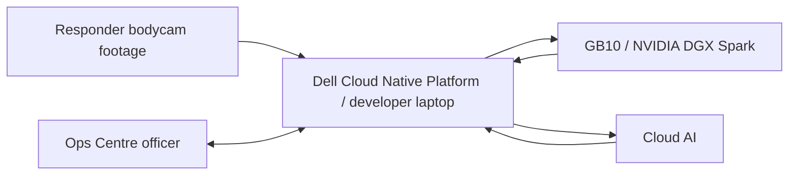

# Project Context

**Last Updated:** 2026-06-18
**Repository:** 1stSight
**Repo Root:** `/home/adoreblvnk/Documents/1stSight`

## 1. Project Identity

- **Purpose:** 1stSight is a Command & Control dashboard for live operations and post-incident review, built around responder bodycam footage. It turns responder footage into event timelines, suggested actions, draft reports, and evidence frames so Ops Centre officers can focus on the broader incident picture instead of watching individual feeds.
- **Target Audience:** Primary users are Ops Centre / C&C officers; responder footage comes from firefighters or responders, and the hackathon demonstration is evaluated by SCDF/Dell mentors and judges.
- **Challenge & Platform Context:** 1stSight is for the SCDF-Dell Lifesavers' Innovation Challenge 2026, which asks teams to build a working prototype using automation, data, or AI to assist frontline responders, improve operational effectiveness, and/or improve responder safety.
- **Demo Scope:** The current demo uses three uploaded fire-response videos presented as firefighter bodycam feeds from the Punggol warehouse incident. No responder-safety abuse footage has been ingested yet.

### Demo Narrative

A caller reports a small fire at a Punggol warehouse, and SCDF deploys a Basic Task Force from Punggol Fire Station. 1stSight shows the section moving on a Singapore map toward the warehouse, then enters the live incident dashboard when the section reaches the site. The pre-live brief stays caller-reported only: small warehouse fire, address, caller outside, no visible injuries reported.

Inside the warehouse, the fire may escalate after live footage begins. In the live dashboard, 1stSight starts with an empty event stream and recommendation panel. Live analysis runs continuously, extracts current bodycam frames at request time, appends model-supported events, and appends Ops Centre recommendations only when the event stream supports HQ action.

After the fire escalation review, the officer opens post-incident review for the same three firefighter bodycam feeds. 1stSight indexes Bodycam A, Bodycam B, and Bodycam C as fire-response evidence sources for interior attack, fire escalation, smoke, reduced visibility, and entry-control observations. Searches for abuse, warehouse-owner contact, push, or punch must return no current evidence until separate footage is actually ingested.

## 2. Features

- **Live Deployment Map:** Uses `@vis.gl/react-google-maps` to show a Singapore map with the Basic Task Force moving from Punggol Fire Station to the Punggol warehouse, then enables incident entry once the section reaches the site.
- **Live Responder Feed Area:** Shows equal-weight bodycam feed cards with feed video, responder name, and alert indicators.
- **Live Events Panel:** Starts empty and fills chronologically with compact events from runtime live chunk analysis.
- **Live C&C Dashboard:** Shows responder bodycam feeds, live events, and ops-centre action prompts during the active warehouse incident.
- **Live Recommendations:** Creates reviewable Ops Centre recommendations from the observed live event stream, with a one-phrase reason and source-frame screenshot.
- **Incident Review:** Shows a vertical post-incident evidence timeline with frame screenshots, bounding boxes, short labels, search/filter controls, suggested incident tags/titles, and draft report material after the incident ends.
- **Draft Reports:** Uses `@react-pdf/renderer` to produce PDF structured observation reports from selected incident timelines and relevant evidence images.

## 3. Technology Stack & Versions

### Laptop / Dell Cloud Native Platform

- **Runtime & Languages:** Node.js `24`, npm `11`, TypeScript `5`.
- **Frameworks & Libraries:**
  - **App Framework:** Next.js `16`, React `19`.
  - **UI:** Tailwind CSS `4`, shadcn/ui components, Base UI, motion.
  - **AI SDK:** AI SDK `6`, `@ai-sdk/openai`, `@ai-sdk/openai-compatible`, `ai-sdk-provider-codex-cli`.
  - **Maps:** `@vis.gl/react-google-maps`.
  - **PDF Export:** `@react-pdf/renderer`.
  - **Video Processing:** Use system `ffmpeg` from the host/container path; use `execa` and `sharp` for orchestration and frame/image optimization.
  - **Dates:** `date-fns`.
  - **Validation:** Zod `4`.
- **State & Data:** Core data includes incidents, incident objects, responder video/frame evidence, event timelines, recommendations, decision reviews, and draft reports.
- **Development Runtime:** The developer laptop runs the same application locally during implementation and testing.
- **OpenShift Hosting [Cloud Native Platform]:** Dell Cloud Native Platform / Red Hat OpenShift hosts the deployed dashboard/backend, and the containerized app listens on port `8080`.
- **Registry [Cloud Native Platform]:** Harbor stores the container image used for OpenShift deployment.
- **Route & DNS [Cloud Native Platform]:** OpenShift route provides app access; custom DNS is not required for the hackathon demo.
- **Runtime Secrets [Cloud Native Platform]:** Store `OPENAI_API_KEY`, `GB10_OPENAI_BASE_URL`, `GB10_MODEL_ID`, and `GB10_OPENAI_API_KEY` as OpenShift Secrets for deployed environments.
- **Deployment Credentials [Cloud Native Platform]:** OpenShift login/token or kubeconfig and Harbor username/password or robot token are required for deployment, but they are not app runtime environment variables.
- **Browser Map Key:** `NEXT_PUBLIC_GOOGLE_MAPS_API_KEY` is required for `@vis.gl/react-google-maps`; restrict this browser-exposed key by domain/referrer in Google Cloud.

### GB10 / NVIDIA DGX Spark

- **Role:** Runs the single local GB10 model endpoint for lower-latency local text reasoning where practical.
- **Tech Stack:**
  - **Model Server:** `vLLM`.
  - **API Shape:** OpenAI-compatible `/v1` endpoint.
  - **Local Model:** `nemotron-nano-9b-v2`.
  - **Network Exposure:** Cloudflare Tunnel exposes the GB10 `vLLM` endpoint to the deployed OpenShift app through HTTPS.
  - **App Integration:** AI SDK `@ai-sdk/openai-compatible`.
  - **Endpoint Env:** `GB10_OPENAI_BASE_URL`, using the Cloudflare Tunnel URL for deployed OpenShift and the GB10 LAN URL for local laptop development.
  - **Model Env:** `GB10_MODEL_ID`.
  - **Auth Env:** `GB10_OPENAI_API_KEY` only if endpoint auth is enabled.

### Cloud AI

- **Provider:** OpenAI through AI SDK's OpenAI provider.
- **Model:** `gpt-5.5` is the highest-accuracy Cloud AI model for multimodal vision, tool calling, and reasoning-heavy workflows where intelligence matters more than local-only execution.
- **API Key:** `OPENAI_API_KEY` is required for OpenAI model calls and must not be exposed through `NEXT_PUBLIC_*`.
- **Dev Fallback Provider:** In AI model use cases, `Dev fallback` means `ai-sdk-provider-codex-cli` on the local laptop through the user's ChatGPT subscription when OpenAI provider credentials or the GB10 endpoint are unavailable; it is not the production Cloud AI path for the deployed demo.
- **Optional NVIDIA NIM:** `NVIDIA_API_KEY` is only required if using hosted NVIDIA NIM APIs instead of the local GB10 endpoint.
- **Compute Boundary:** OpenShift does not provide GPUs for hosted LLMs; GPU-backed local inference runs through GB10, while cloud inference runs through external provider APIs.

### AI Model Use Cases

- **Video-to-structured incident extraction (vision):** Model: `gpt-5.5`; Dev fallback: `gpt-5.5`; converts one-second bodycam samples into structured incident objects, timestamps, source references, and short evidence descriptions.
- **Best evidence frame selection (vision):** Model: `gpt-5.5`; Dev fallback: `gpt-5.5`; selects the clearest screenshot/frame that supports each incident object, especially flame burst, smoke, visibility, and entry-control evidence.
- **Bounding box and visual label generation (vision):** Model: `gpt-5.5`; Dev fallback: `gpt-5.5`; creates approximate bounding boxes and one-phrase labels for fire growth, smoke spread, blocked exits, unsafe entry, visibility, and entry-control evidence.
- **Incident matching, grouping, and titling:** Model: `Nemotron Nano 9B v2`; Dev fallback: `gpt-5.2-codex-mini`; determines whether a new incident object belongs to an existing incident or starts a new one, then groups related objects under titles such as Fire Response Bodycam Set or Fire Escalation.
- **Live recommendation generation:** Model: `gpt-5.5`; Dev fallback: `gpt-5.5`; creates reviewable Ops Centre recommendations such as Deploy Enhanced Task Force with a reason phrase and evidence frame.
- **Natural-language post-incident search:** Model: `Nemotron Nano 9B v2`; Dev fallback: `gpt-5.2-codex-mini`; maps officer queries such as `Bodycam B escalation` or `Bodycam C smoke` to relevant incidents, tags, and evidence cards after keyword/tag retrieval; abuse-related queries return no current evidence until footage is ingested.
- **Post-incident timeline summarization:** Model: `Nemotron Nano 9B v2`; Dev fallback: `gpt-5.3-codex`; turns captured incident objects into a chronological evidence timeline for review.
- **Report evidence selection (vision):** Model: `gpt-5.5`; Dev fallback: `gpt-5.5`; selects only the relevant screenshots/evidence cards from selected incidents for inclusion in the report.
- **Structured observation report generation:** Model: `Nemotron Nano 9B v2`; Dev fallback: `gpt-5.3-codex`; generates selected-incident observation reports with relevant screenshots and concise analysis.

## 4. Run & Development Commands

- **Prerequisites:** Docker, Git, Node.js `24`, npm `11`, system `ffmpeg`, OpenShift/Keycloak access, and Harbor access.
- **Start Services:** `npm run dev` for local development; containerized deployment runs the app on port `8080` for OpenShift.
- **Useful Commands:** `npm run lint`, `npx tsc --noEmit`, `npm run build`.

## 5. Critical Implementation Rules & Conventions

- **Product Posture:** Build 1stSight as a production-shaped prototype, not a throwaway mockup. Use real product boundaries with real API / AI calls.
- **Code Organization:** Implement the app as a root-level Next.js App Router project using `src/app`, `src/components`, `src/lib`, and browser-served media under `public/videos`.
- **State Management:** Keep stable scenario metadata and source media lists minimal; post-incident evidence, frame selection, boxes, search answers, and report claims must come from runtime analysis state rather than precomputed scenario evidence.
- **API & Data Fetching:** Keep model calls behind backend/API boundaries so the Ops Centre workflow is not coupled to a specific model provider.
- **AI Output Contract:** All model pipeline steps must use structured output validated with Zod; vision is required only for use cases marked `(vision)`, and tool calling is optional for the demo pipeline.
- **Development Model Fallback:** `ai-sdk-provider-codex-cli` may replace OpenAI provider or GB10 calls only for local laptop development; keep the same Zod-validated structured schemas and avoid optional schema fields in Codex object generation.
- **Demo Algorithms:**
  - **Video chunking:** Split bodycam footage into 5-second chunks.
  - **Frame sampling:** Sample 1 frame per second from each chunk.
  - **Incident extraction:** Use `gpt-5.5` to convert sampled frames into structured incident objects.
  - **Incident merging:** Merge repeated incident objects with simple rules.
  - **Evidence scoring:** Score candidate evidence frames for review and reporting.
  - **Review annotation:** Generate review-only bounding boxes and short labels for selected evidence frames.
  - **Recommendation trigger:** Create reviewable recommendations when incident evidence crosses the demo threshold.
  - **Timeline and report generation:** Use `Nemotron Nano 9B v2` to generate post-incident timelines and structured observation reports.
- **Types/Interfaces:** Use explicit domain models for incidents, responders, evidence, events, recommendations, decision reviews, map markers, and reports.
- **AI Autonomy:** AI may autonomously create incident titles, incident objects, timeline entries, evidence screenshots, tags, and draft recommendations; humans review important or high-impact decisions such as Enhanced Task Force deployment and final report conclusions.
- **Demo Reliability:** If runtime AI/API analysis fails, show an unavailable/error state instead of substituting fabricated evidence or static analysis. Demo assets may seed source video playback only.
- **Safety Boundaries:** Do not present 1stSight as autonomous tactical command, a medical diagnosis system, facial recognition, or an official SCDF Fire Report / Ambulance Report generator unless explicitly approved.

## 6. Architecture Diagram & Demo Flow

### Demo Flow

#### End User: Responder Source

1. Responder bodycam viewpoint is represented by staged or sourced fire-response footage loaded into 1stSight.
2. 1stSight presents the footage as live responder feeds during the demo.
3. Source video is chunked into 5-second segments and sampled at 1 frame per second.
4. Each sampled frame keeps responder, source video, chunk, frame, and timestamp references.

#### Ops Centre Officer: Live Incident

1. Officer opens the deployment map and watches the Basic Task Force travel from Punggol Fire Station to the Punggol warehouse.
2. Officer enters the live incident dashboard when the section reaches the incident site.
3. Officer monitors responder feed cards, live events, and action prompts.
4. Live chunk analysis runs against the current bodycam feeds.
5. 1stSight creates incident timeline evidence and a recommendation only when the returned model evidence supports it.
6. Officer reviews the recommendation and can approve, reject, or edit the decision record.

#### Ops Centre Officer: Post-Incident

1. Officer switches to incident review after the live scenario ends.
2. Officer searches naturally for Bodycam A, Bodycam B, Bodycam C, fire escalation, smoke, visibility, or entry-control evidence.
3. Runtime analysis starts automatically; 1stSight extracts frames from the current fire-response videos and asks the configured model to select review evidence.
4. Officer reviews generated evidence cards with model-returned bounding boxes, one-phrase labels, source references, and review state.
5. Officer rejects false flags or adjusts selected evidence if needed.
6. Officer exports a structured observation report containing only the selected incident evidence and analysis.

### Rough 10-Minute Presenter Flow

The demo should be presenter-controlled rather than video-length-controlled. Fire clips can run in parallel as three responder feeds, with the fire escalation appearing around `1:20` in the relevant feed. The UI should include `Pause / Resume`, `Jump to escalation`, `Open fire evidence review`, and `Conclude incident` controls so presenters can slow down for judges or skip ahead when needed.

| Approx. time | Demo beat | Product moment |
| --- | --- | --- |
| 0:00-1:00 | Introduce the raw-bodycam monitoring problem and 1stSight's Ops Centre role. | Show 1stSight as Command & Control intelligence, not a bodycam replacement. |
| 1:00-1:45 | Explain that SCDF has received a call for a fire at a Punggol warehouse, then click the Basic Task Force as it reaches the site. | Map transitions into the live incident dashboard. |
| 1:45-3:30 | Let the three fire feeds run in parallel and explain the monitoring load. | Live feed cards, live events, and source-linked timeline begin filling in. |
| 3:30-4:45 | Fire escalation is detected or jumped to if timing needs compression. | 1stSight creates Fire Escalation evidence and recommends Deploy Enhanced Task Force. |
| 4:45-5:45 | Explain human-in-the-loop approval. | Officer reviews reason and evidence, then approves, rejects, or edits the decision record. |
| 5:45-6:45 | Open fire evidence review after the escalation and recommendation review. | Bodycam A, Bodycam B, and Bodycam C are shown as fire-response evidence sources. |
| 6:45-8:15 | Conclude the incident and open review mode. | Runtime analysis starts automatically, then the officer searches by firefighter, fire escalation, smoke, or entry-control observations across the generated evidence cards. |
| 8:15-9:15 | Show evidence review and report generation. | Bounding boxes, one-phrase labels, source references, false-flag rejection, and structured observation report export. |
| 9:15-10:00 | Close with architecture and deployment story. | Dell Cloud Native Platform hosts the app, GB10 handles local text reasoning, and Cloud AI handles vision-heavy tasks. |

## 7. State Models

- **Incident:** Top-level scenario group such as Fire Response Bodycam Set or Fire Escalation, containing related incident objects and report state.
- **IncidentObject:** Atomic incident evidence item such as flame burst frame, smoke spread frame, blocked exit frame, entry-control frame, recommendation, or officer approval.
- **Responder:** Firefighter/responder identity, role, feed/source reference, and current position/status where available.
- **FrameEvidence / VideoEvidence:** One-second sampled source video segment or best-supporting frame with timestamp, responder/source, labels, bounding boxes, and links to incident objects.
- **IncidentEvent:** Timeline item derived from AI processing, human review, or system status updates.
- **SuggestedAction:** Ops-centre recommendation such as ambulance support, evacuation support, command review, or Enhanced Task Force escalation.
- **DecisionReview:** Human review record for important AI outputs, high-impact recommendations, official facts, and report conclusions.
- **EvidenceCard:** Post-incident screenshot/frame card with short description, incident tag, bounding box, one-phrase label, and review state.
- **DraftReport:** Structured observation report generated from selected incidents and relevant evidence images; if no incident is selected, include all incidents.

## 8. External Integrations & APIs

- **Dell Cloud Native Platform / OpenShift:** Deployment foundation for the dashboard/backend.
- **Harbor:** Image registry for OpenShift deployment.
- **Keycloak:** Platform authentication for OpenShift and Harbor access.
- **Dell GB10:** Local compute layer for text reasoning through a single `Nemotron Nano 9B v2` endpoint; note Dell GB10 as NVIDIA DGX Spark, with Dell materials also naming Dell AI PC / Dell Pro Max with GB10.
- **Cloudflare Tunnel:** Secure HTTPS tunnel from the deployed OpenShift app to the GB10-hosted OpenAI-compatible `vLLM` endpoint.
- **NVIDIA NIM:** Model-serving path through hosted API calls or self-hosted containers, subject to GB10/GPU limits.
- **Cloud AI Providers:** Use AI SDK's OpenAI provider for `gpt-5.5` via OpenAI key and AI SDK's OpenAI-compatible provider for the local hosted GB10 model exposed through an OpenAI-compatible endpoint.
- **Video Sources:** Current demo footage uses three fire-response clips served from `public/videos/fire/` as `/videos/fire/fire-feed-a.mp4`, `/videos/fire/fire-feed-b-escalation.mp4`, and `/videos/fire/fire-feed-c.mp4`.

## 9. Assumptions, Risks & Missing Information

- **Assumption:** `PROJECT_CONTEXT.md` is the single source of truth for current product, demo, architecture, and implementation direction.
- **Risk:** Fire-response footage may require careful sourcing, editing, and usage checks; separate responder-safety footage must not be claimed until it is actually ingested.
- **Risk:** GB10 availability, model compatibility, and Cloudflare Tunnel reachability must be validated before relying on local text reasoning in the deployed demo.
- **Risk:** Cloud AI use for sensitive incident footage requires explicit data-governance approval before any real SCDF-like data is sent to third-party providers.
