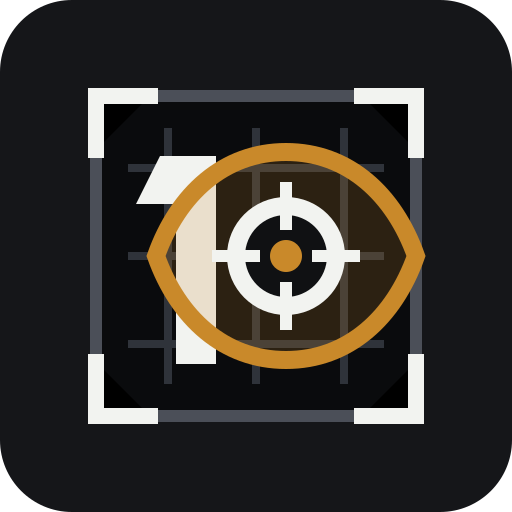
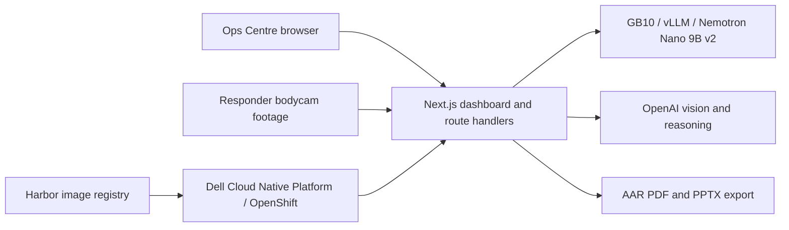
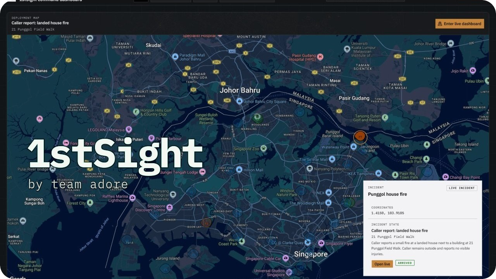

<div align="center">
  
  <h1>1stSight</h1>
  <p>
    Live recommendations, searchable incident timelines &amp; AAR slide generation from SCDF bodycam streams.
  </p>
  <p>
    3rd place ($3000) at <a href="https://www.instagram.com/p/DXJYR7MFRDe">SCDF x Dell Innovation Challenge</a>.
  </p>
  <p>
    Built With: Next.js &bull; React &bull; TypeScript &bull; AI SDK &bull; Tailwind CSS &bull; shadcn/ui &bull; vLLM &bull; OpenShift
  </p>
</div>

---

<details>
<summary>Table of Contents</summary>

- [About](#about)
- [Demo](#demo)
- [Getting Started](#getting-started)
  - [Prerequisites](#prerequisites)
  - [Installation](#installation)
  - [Execution](#execution)
- [Usage](#usage)
</details>

## About

1stSight is a production-shaped prototype built for the SCDF-Dell Lifesavers' Innovation Challenge 2026. It helps SCDF Ops Centre / Command & Control officers turn responder bodycam footage into a traceable incident timeline, live evidence cards, reviewable command recommendations, natural-language evidence search results, and concise AAR briefing slides in PDF and editable PPTX formats.

The primary stage scenario follows one Punggol landed-house fire incident from dispatch to live fire response, fire escalation, post-fire welfare check, responder-safety evidence, officer-reviewed action prompts, post-incident review, and AAR briefing slide generation. Woodlands medical assistance remains available as a booth or secondary responder-safety review flow.

High-impact actions remain officer-reviewed, and exported decks are AAR briefing material that can support later reporting.



## Demo

<div align="center">
  <a href="https://www.youtube.com/watch?v=WLZtab6MVMg">
    
  </a>
  <p><a href="https://www.youtube.com/watch?v=WLZtab6MVMg">Watch the 1stSight demo on YouTube</a></p>
</div>

| Route | Purpose |
| --- | --- |
| `http://localhost:3000/map?incident=punggol-residential-fire` | Stage start point with deployment map and incident selection |
| `http://localhost:3000/live?incident=punggol-residential-fire` | Live C&C dashboard with bodycam feeds, events, and officer-reviewed recommendations |
| `http://localhost:3000/review?incident=punggol-residential-fire` | Post-incident evidence timeline, search, and AAR export |
| `http://localhost:3000/bodycam` | Browser camera capture surface for live stream ingestion |

| Incident ID | Status |
| --- | --- |
| `punggol-residential-fire` | Primary live stage flow with fire response and post-fire responder-safety review |
| `woodlands-medical-responder-safety` | Booth / secondary post-incident responder-safety AAR review |
| `stage-medical-assistance-stream` | Live browser bodycam stream route for evaluator try-out |
| `jurong-chemical-leak` | Map catalogue incident surface |
| `tampines-mall-medical-assist` | Review catalogue incident surface |

The current media inputs are served from `public/videos/fire/` and `public/videos/woodlands/`. Generated evidence frames are cached under `.next/cache/` during runtime analysis.

## Getting Started

### Prerequisites

- Node.js and npm.
- Git and Docker.
- System `ffmpeg` and `ffprobe` for frame extraction.
- OpenShift CLI `oc`, OpenShift/Keycloak access, and Harbor access for deployment.
- `cloudflared` and Docker on the GB10 host if using the local GB10 model endpoint.
- `OPENAI_API_KEY` for OpenAI vision/reasoning paths.
- `NEXT_PUBLIC_GOOGLE_MAPS_API_KEY` for the browser map.

Important environment variables are listed in `.env.example`:

| Variable | Purpose |
| --- | --- |
| `AI_MODEL_MODE` | Model routing: `gb10-openai`, `codex`, or `openai` |
| `GB10_OPENAI_BASE_URL` | OpenAI-compatible GB10 / vLLM endpoint |
| `GB10_OPENAI_API_KEY` | Token for the GB10 endpoint when enabled |
| `OPENAI_API_KEY` | Server-side OpenAI key for cloud model calls |
| `NEXT_PUBLIC_GOOGLE_MAPS_API_KEY` | Browser-exposed Google Maps key |
| `NEXT_PUBLIC_WEBRTC_*` | Optional TURN / ICE settings for browser bodycam streaming |
| `REGISTRY`, `TEAM_NAME`, `IMAGE_NAME` | Harbor image coordinates for deployment |
| `APP_NAME`, `CONTAINER_NAME`, `SECRET_NAME` | OpenShift deployment and secret names |

### Installation

Install dependencies from the repository root:

```bash
npm ci
```

Create a local `.env` from `.env.example`, then fill the runtime values needed for the model mode you are using.

Common local GB10 plus OpenAI vision setup:

```bash
AI_MODEL_MODE=gb10-openai
GB10_OPENAI_BASE_URL=http://192.168.0.102:8000/v1
GB10_OPENAI_API_KEY=local-dev-token
OPENAI_API_KEY=<cloud-vision-key>
NEXT_PUBLIC_GOOGLE_MAPS_API_KEY=<browser-map-key>
```

Codex CLI provider setup for local development:

```bash
AI_MODEL_MODE=codex
```

Run `codex login` before using `AI_MODEL_MODE=codex`.

### Execution

Start the app locally:

```bash
npm run dev
```

The dev server runs Next.js with webpack. In development, `src/instrumentation.ts` logs model reachability with `[dev-health]` messages for the selected `AI_MODEL_MODE`.

Run checks before a demo or deployment:

```bash
npx tsc --noEmit
npm run lint
npm run build
```

Smoke-test the GB10 OpenAI-compatible endpoint:

```bash
GB10_OPENAI_BASE_URL=http://192.168.0.102:8000/v1 \
GB10_OPENAI_API_KEY=local-dev-token \
./scripts/gb10-smoke.sh
```

Start the validated GB10 vLLM container and Cloudflare Tunnel on the GB10 host:

```bash
export GB10_OPENAI_API_KEY=local-dev-token
./scripts/gb10-run.sh
```

Build and deploy to OpenShift through Harbor:

```bash
./scripts/deploy.sh
```

## Usage

1. Open `/map?incident=punggol-residential-fire`.
2. Select the Punggol house fire marker and enter the live dashboard after dispatch preview.
3. Watch Bodycam A, Bodycam B, and Bodycam C during the fire-response phase.
4. Review live event cards and evidence thumbnails as they appear.
5. Mark ETF consideration prompts for Ground Commander review when supported by evidence.
6. Advance feeds into the post-fire sweep.
7. Review post-fire responder-safety evidence and mark police-support guidance for Ground Commander consideration.
8. Open `/review?incident=punggol-residential-fire` and run post-incident analysis if needed.
9. Search analyzed evidence with rough officer language such as `drunk abuse`; results should still be framed as physical contact, unsafe proximity, impact/recovery, and responder-safety evidence.
10. Export the selected evidence as AAR briefing PDF or PPTX. With no search active, export covers the full Punggol timeline; with responder-safety search active, export focuses on highlighted matching evidence.

Model routing:

| Mode | Text tasks | Vision tasks |
| --- | --- | --- |
| `gb10-openai` | Nemotron Nano 9B v2 via vLLM | GPT 5.5 |
| `openai` | GPT 5.5 | GPT 5.5 |
| `codex` | `ai-sdk-provider-codex-cli` with GPT 5.5 | `ai-sdk-provider-codex-cli` with GPT 5.5 |

All model pipeline outputs are validated with Zod schemas before they are used by the UI or export pipeline.

## License <!-- omit in toc -->

Distributed under the MIT License. See [LICENSE](LICENSE) for details.
